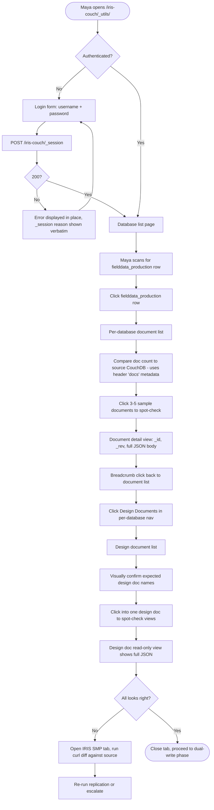
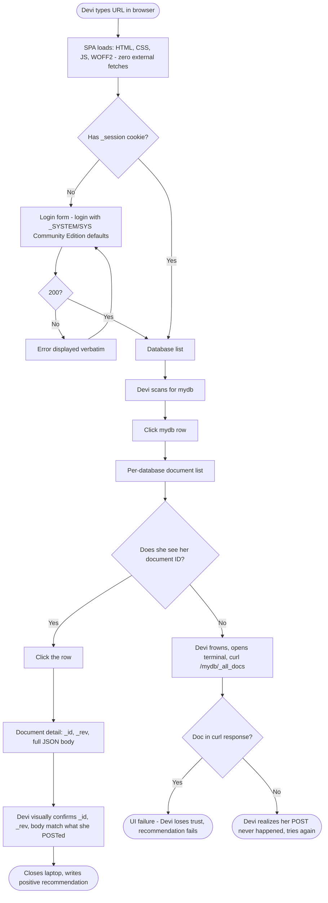
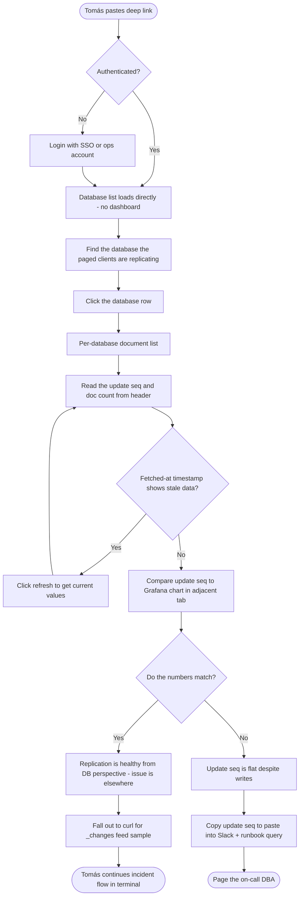
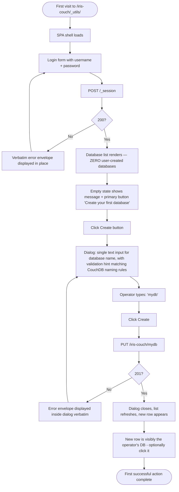
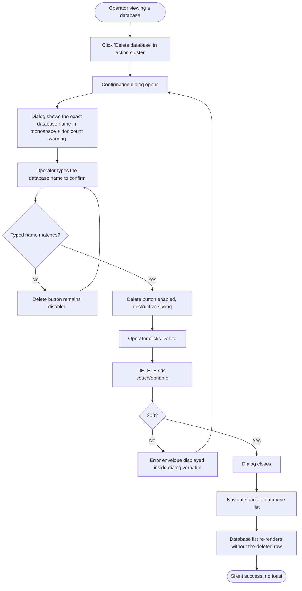

# UX Design Specification — iris-couch

**Author:** Developer
**Date:** 2026-04-11

---

<!-- UX design content will be appended sequentially through collaborative workflow steps -->

## Executive Summary

### Project Vision

IRIS Couch is a wire-compatible Apache CouchDB 3.x server implemented natively in InterSystems IRIS ObjectScript. The vast majority of the product has *no UI at all* — the success criterion for the client-developer persona is literally "nothing happens" when an application is repointed from Apache CouchDB to IRIS Couch. The UX surface in scope for this specification is therefore narrow and deliberate: a single built-in **administration UI** mounted at `/iris-couch/_utils/`, defined by FR83–FR95 of the PRD, implemented as a TypeScript + Angular single-page application compiled to static assets and shipped inside the ObjectScript package.

The admin UI exists for one reason: to give operators a one-click visual confirmation path during install, migration, and evaluation without requiring them to install Fauxton, stand up a separate tool, or drop back to curl. Its guiding principle is **disciplined minimalism** — it is a first-class part of IRIS, not a port of Fauxton, and it actively resists feature creep. Every screen must justify itself against a concrete operator journey from the PRD.

The aesthetic target is **calm, IRIS-native, and operator-focused**: the baseline comparison is the IRIS Management Portal that these operators already use every day, not Fauxton's visual style. The UI should feel like a native IRIS Management Portal module that happens to speak CouchDB concepts, and that feeling of belonging is itself a differentiator no other CouchDB-compatible project has delivered.

### Target Users

The admin UI has three concrete operator personas, all drawn from PRD § User Journeys. It has *no* end-user, customer, or patient-facing surface. There is no PHI presentation layer, no mobile requirement, and no multi-tenant customer dashboard.

**Primary — Maya, the HealthShare platform engineer retiring a standalone CouchDB (Journey 1).**
Senior, IRIS-fluent, CouchDB-competent-but-uncomfortable. Uses the admin UI during a migration window to create a target database, visually confirm that replicated-in documents and design documents arrived intact, and verify per-database metadata. Her baseline UX expectation is the **IRIS Management Portal**, not Fauxton — she is switching between the two during her task. She values density and precision over polish.

**Primary — Devi, the tech lead evaluating IRIS Couch in a 60-minute spike (Journey 5).**
Brand-new to the project, IRIS-adjacent, under a hard time pressure because her architecture review is tomorrow. Uses the admin UI as the visual confirmation step inside the Getting Started walkthrough: install, create `mydb`, POST a document via curl, open `_utils`, see the database and document, close laptop. Her success is the whole evaluation funnel closing in under an hour. She values **first-session legibility** — nothing should require reading docs to understand what a screen is showing.

**Secondary — Tomás, the post-α SRE debugging a replication lag incident at 02:14 (Journey 4).**
Not a CouchDB expert, inherited the system from whoever installed it. Lives in Grafana, the runbook, and curl during the incident; touches the admin UI only sparingly — most likely to spot-check per-database update sequence or browse a recent document to confirm a suspicion. His requirement is that the UI does not **get in the way** when he does use it: no modal popups, no animations that hide data, no navigation that costs him steps he cannot afford at 2 AM.

**Tertiary — the author dogfooding customer zero (Journey 3).**
The project's sole developer, running IRIS Couch against three real production CouchDB databases between every release. This persona has the deepest possible product knowledge and uses the UI mostly as a correctness check. Has the highest tolerance for raw detail (JSON envelopes, rev trees, error `reason` strings surfaced verbatim) and the lowest tolerance for UI that hides information behind friendly abstractions.

**Explicit non-users.** End users of downstream applications (field health workers, patients, PouchDB-app mobile users) never see this UI. Application developers (Amelia in Journey 2) never see it either — their journey is deliberately a non-event. Designing for anyone beyond the four operator personas above is out of scope.

### Key Design Challenges

1. **"Resist the urge to become Fauxton."** The default instinct for any admin UI is to keep adding panels. The PRD has drawn a hard scope line at FR83–FR95 and the design has to actively defend it. Every proposed screen, control, and panel must answer "which of Maya, Devi, Tomás, or the author needs this *during their specific journey*?" — if the answer is none, it does not ship.

2. **Phased capability without visible rearrangement.** The same UI ships as α (read-only for design docs and `_security`), β (editable), and γ (gains revision history). The information architecture has to absorb these additions without visibly reshuffling between releases — α must look *intentionally small*, not *unfinished*.

3. **Operator muscle-memory tension.** CouchDB operators expect Fauxton conventions; IRIS operators expect Management Portal conventions. The UI serves both audiences and cannot fully mimic either. Every navigation and labeling decision has to pick a side or find a genuinely neutral third path.

4. **Errors as first-class UI content.** The project hinges on honest, specific, actionable error messages — the JSON `reason` field names the subsystem and the specific failure mode (e.g., "JSRuntime.None is the default; enable JSRuntime.Subprocess..."). The admin UI must surface those verbatim, not sanitize them into a generic "something went wrong." Error rendering is a design surface, not an afterthought.

5. **Zero-dependency install constraint.** The UI cannot load external fonts, CDN assets, runtime npm modules, or any resource not shipped inside the ObjectScript package. Every visual asset — fonts, icons, stylesheets — must be inlined or locally served. This eliminates entire categories of design solution (Google Fonts, Material Icons CDN, Tailwind Play CDN) before we even start.

### Design Opportunities

1. **Calm, IRIS-native aesthetic as a differentiator.** Because the operator baseline is the IRIS Management Portal rather than Fauxton, iris-couch can feel like a *first-class part of IRIS* — a coherent module of the operator's existing tooling rather than a foreign body. No other CouchDB-compatible project has this option, because no other CouchDB-compatible project lives inside IRIS.

2. **The 60-minute-spike path as a named flow.** Devi's journey is a concrete, time-boxed evaluator funnel and it is the project's highest-leverage adoption moment. The admin UI can be the visible thing that makes her spike succeed — and should be designed against that specific flow (install → open `_utils` → see `mydb` → spot-check document → close laptop) as a first-class use case, not as an emergent side effect.

3. **Read-first, write-second hierarchy.** Most of α is read-only. Rather than apologizing for that, the design leans into it: *"an inspection tool that grows editing powers over time."* This story is coherent, matches how operators actually approach unfamiliar systems, and gives α a clear reason to exist rather than feeling like a stub of β.

4. **Error envelopes as live protocol debugger.** Surfacing iris-couch JSON error envelopes verbatim — including the `reason` field and the subsystem name — turns the admin UI into a light protocol inspector. Useful to Devi during evaluation, to Tomás during incidents, and to the author during dogfooding. This is the *opposite* of the "friendly error message" default most admin tools ship with, and it is correct for this audience.

5. **Scope-discipline as a trust signal.** A deliberately small, obviously-not-Fauxton admin UI is itself a message to adopters: *this project knows what it is and is not trying to be.* That trust signal matters disproportionately for a project whose whole value proposition is "we are doing the narrow, disciplined version of CouchDB-compat that the other reimplementations failed at."

## Core User Experience

### Defining Experience

**The core user action is "Open `_utils`, see the truth."** The single most-frequent, most-load-bearing interaction is: an operator who has just done something via the HTTP API — replicated a database in, created a DB via curl, POSTed a document, rolled out a migration — opens `/iris-couch/_utils/` in a browser tab and visually confirms that what they think happened actually happened. This is the core loop for Maya during migration, for Devi during her 60-minute spike, for the author during dogfooding, and for Tomás during incident response. Every one of their journeys in the PRD bottoms out at this same beat: *did reality match my model?*

If this interaction is effortless — if the operator lands on a page that shows them the current, accurate, unambiguous state of their databases and documents within one or two clicks and zero scroll-hunting — the rest of the admin UI falls into place. If it is not effortless, the rest of the UI is window-dressing.

Corollary: **the UI is fundamentally a read tool with occasional write affordances, not a CRUD panel.** Its defining action is *inspection*, not *editing*. Editing (β design docs, β `_security`) happens on the way past during inspection, not as a destination.

### Platform Strategy

- **Platform: browser, desktop-class only.** Chrome, Firefox, Safari, Edge — current versions. No mobile layout. No tablet optimization. Operators are at a workstation when they touch this tool — Maya is at her desk, Devi is on her laptop, Tomás is SSH'd in from a laptop at 2 AM, the author is in the IRIS Management Portal tab next to this one. Explicitly **not designing for touch**; mouse and keyboard is the contract.
- **Viewport floor: 1280×800.** Above that we can use real density; below, we don't support. Consistent with how the IRIS Management Portal behaves on small laptops.
- **Served from IRIS.** The SPA is static assets in the ObjectScript package, mounted at `/iris-couch/_utils/`. First request ships the app; everything after is API calls against iris-couch's own HTTP surface. No SSR, no edge caching, no second origin.
- **Offline is not a requirement.** If the iris-couch HTTP surface is down, the admin UI is not expected to be useful — it is a window into that surface, not a replacement for it. Graceful error states, not offline fallback.
- **Authentication is the CouchDB cookie-auth flow.** `_session` POST, session cookie, standard 401 → login redirect. There is no new auth UX to invent — it piggybacks on the existing `_session` contract. The only UI surface for auth is a login screen that posts to `_session` and an unobtrusive "signed in as X / sign out" marker.
- **Zero external resources.** No Google Fonts, no Material Icons CDN, no runtime npm, no analytics, no telemetry beacons. Every byte the browser loads is served from `/iris-couch/_utils/` itself. This is a hard technical constraint from the zero-dependency-install principle and a quiet UX signal — the tool loads instantly on an air-gapped hospital network, which is non-trivial to the healthcare audience.
- **Browser tab coexistence.** The operator always has adjacent tabs open: the IRIS Management Portal, Grafana, the runbook, a terminal with curl. The UI must play nicely with tab-switching — no modal state that resets on focus loss, no "oops you lost your place" behavior, stable URLs for every view so tab-reopen restores context.

### Effortless Interactions

1. **"Is `mydb` there?"** From cold-open URL to seeing the database list: ≤2 seconds on localhost and ≤1 click from login. No dashboard landing screen, no welcome modal, no "getting started" panel in the way. Land on the list.
2. **"Is my document in it?"** From database list to viewing an individual document: two clicks maximum (database row → document row). No intermediate "database overview" wizard between the list and the documents.
3. **Deep-linkable everything.** Every view (database, document, design doc, `_security`, rev history) has a stable shareable URL. Operators need to paste a link into Slack during an incident — every screen must support that without exception.
4. **Copy raw JSON in one click.** Every document, design doc, `_security` doc, and error envelope has a "copy raw JSON" affordance. The most common operator follow-up after "look at this" is "paste this into a curl command or a ticket."
5. **No confirmation dialogs for reversible actions.** Navigation, sorting, filtering, and pagination never ask "are you sure." Only genuinely destructive actions (DB delete in α, design-doc delete / `_security` edit in β) prompt — and those prompts must name the exact thing being destroyed, not a generic "continue?"
6. **Errors surface the server's `reason` verbatim.** When iris-couch returns a JSON error envelope with `{"error":"...","reason":"..."}`, the UI displays those two strings as the primary error text — not wrapped, not translated, not softened. This is effortless for the operator because it *matches what they would see via curl*, which is the tool they trust.

### Critical Success Moments

1. **Devi's "this is real" moment (60-minute spike).** She has POSTed a document via curl. She clicks into the admin UI for the first time. The moment she sees `mydb` in the list and her document with the right `_id` and `_rev` inside it — in ≤2 clicks, zero reading, zero configuration — is the moment iris-couch earns its "recommend for architecture review" vote. If she has to hunt, read, or configure anything to reach this moment, the spike fails and the recommendation fails with it.
2. **Maya's "the design docs came across" moment (migration validation).** She has just replicated her first production database from Apache CouchDB into iris-couch. The moment of truth is clicking into `_design/` for that database and seeing the design document titles that match what was on the source. If that list is accurate and legible, she trusts the replication. If it is missing documents, shows them in an inconsistent order, or obscures them behind drilldowns, her confidence collapses regardless of what the `_all_docs` diff said.
3. **Tomás's "nothing in the UI is lying to me" moment (incident triage).** At 02:14, he's trying to decide whether iris-couch is the culprit for replication lag. He loads the UI, checks the per-database update-sequence counter and doc count, and — critically — trusts that what he's seeing is *current truth*, not a cached snapshot from an hour ago. If the UI displays stale numbers without clearly saying so, it poisons his triage. A wrong number would be catastrophic; an explicitly-labeled "refreshed 3s ago" is fine.
4. **The author's "I can spot the bug from here" moment (dogfooding).** During customer-zero dogfooding, the author is looking at documents *to find bugs in iris-couch itself*. The success condition is that the UI shows enough raw detail — `_rev`, full JSON body, revision history at γ, attachment metadata — that she does not have to drop to curl to confirm what she is seeing. Any detail hidden "for friendliness" pushes her back to curl and costs her the UI's reason to exist.
5. **First-install hot path.** A brand new operator, 60 seconds after ZPM install finishes, types `/iris-couch/_utils/` into their browser. They see a login screen, log in as the IRIS user they already have, and land on an empty database list with one visible, unmistakable action: *"Create your first database."* That first-minute-of-ownership flow is the project's first impression, and it is make-or-break for adoption.

### Experience Principles

1. **Narrow is the feature.** Every screen defends its scope. If a feature is not required by Maya, Devi, Tomás, or the author in a journey the PRD has already named, it does not ship — and we say so out loud in the empty state where a Fauxton user might expect it. Scope discipline is a trust signal to the same operators who chose iris-couch *because* it is scope-disciplined.
2. **Show the truth, not a flattering version of it.** Raw `_rev` strings, full error envelopes, exact document counts, explicit refresh timestamps. The operator's trust is earned by accuracy, not by polish. When the server says something ugly, the UI repeats it unchanged.
3. **Read is the default, write is earned.** α ships read-only for design docs and `_security`; β adds editing; γ adds revision history. Each new edit affordance is added *in place* on an existing read view — never a new section. Operators who already know the read view get the write view for free.
4. **First click ≤1 second, second click ≤2 clicks away.** Login → list → document is the universal hot path. Every design decision is measured against whether it protects or erodes that path.
5. **Stable URLs, stable layout, stable state.** Every view is deep-linkable. Every navigation is predictable. Tab-switching, refresh, and copy-link-from-address-bar always do the obvious thing. This is how operators actually use admin tools — the UI must meet them there.
6. **Feel like IRIS, not like Fauxton.** Visually, typographically, and behaviorally the UI is a member of the IRIS Management Portal family. When Maya switches between the IRIS portal tab and the iris-couch `_utils` tab, the transition should feel like *the same tool with a different subject*, not like switching products.
7. **Never hide a failure.** Network errors, 401s, 500s, stale data, JSRuntime 501s — all surface immediately and in place, with the server's `reason` verbatim. There is no silent retry, no "something went wrong" generic envelope, no toast that disappears before the operator can read it.
8. **Zero dependency, zero surprise.** No CDN assets, no external calls, no telemetry, no tracking. The UI is the same on an air-gapped hospital network as it is on a laptop in a café. Operators in regulated environments notice, and it matters.

## Desired Emotional Response

The admin UI is a professional tool used by operators under pressure — often during migrations or incidents. The desired emotional response is therefore **not delight** in the ordinary consumer-product sense. It is something more specific and arguably more valuable: **earned, quiet trust**. Every emotional design decision is measured against that register.

### Primary Emotional Goals

**Primary emotion — confident calm.** When an operator is using iris-couch's admin UI, they should feel like an expert pilot in a cockpit they understand. Not excited, not delighted — *settled*. The UI is telling them what is true, in the order they need to know it, with no surprises, no animations, no "help me out" moments. The operator walks away from the session thinking not "that was great" but "that worked — next thing."

This matches the operator personas precisely. Maya during a migration does not want delight; she wants to stop worrying about the CouchDB process. Devi during her 60-minute spike does not want to be charmed; she wants to close her laptop with a clear recommendation. Tomás at 02:14 actively *resents* delight — he wants the system to shut up and show him the data. The author dogfooding wants the UI to get out of the way so she can find the bug. The common thread is confidence without ceremony.

**The emotion that would make them tell a friend — relief.** *"I didn't have to install Fauxton. I didn't have to SSH in. I didn't have to touch curl. I just opened `_utils` and everything I needed was there."* That sentence — *"everything I needed was there"* — is the one-line review iris-couch's admin UI is designed to earn. Not "it's beautiful," not "it's fast," but *"it had what I needed and nothing I didn't."* Relief is a harder emotion to earn than delight because it requires the UI to have anticipated the operator's actual job rather than performed sophistication for its own sake.

**The emotion that differentiates from Fauxton — belonging.** Fauxton feels like a third-party tool bolted onto CouchDB. Iris-couch's admin UI should feel like *it was always part of IRIS* — a module of the Management Portal family that happens to speak the CouchDB vocabulary. For an IRIS-native operator, that belonging is a felt sense: the navigation is where they expect, the density is what they're used to, the typography is recognizable, the error envelopes look like IRIS's not like Bootstrap 3's.

### Emotional Journey Mapping

**First discovery (0–30 seconds).** The operator has just finished ZPM install and types `/iris-couch/_utils/` into the browser. Target emotion: **quiet recognition**. "Oh — it looks like part of IRIS. Good." The login screen is unremarkable (which is the goal — an unremarkable login screen is a trust signal in an admin tool). First load is instant because there are no external resources to fetch. The operator does not say anything out loud; they just start working.

**First successful action (30 seconds – 2 minutes).** The operator creates or finds their first database, clicks in, and sees a document. Target emotion: **validation, not celebration**. There is no confetti, no toast, no "Great job!" copy. There is a database list that now has one more row in it, or a document detail view showing the right `_id`, `_rev`, and body. The validation comes from *accuracy*, not from feedback. If the operator smiles at this moment, it is because they just proved to themselves that iris-couch is real — the UI did not have to earn the smile separately.

**During the core loop — inspection, navigation, copy-paste (ongoing).** Target emotion: **flow without friction**. The operator should lose track of the UI entirely. Their attention is on the *data* — "is this document right, is the rev tree sensible, does this design doc match what was on the source?" — and the UI is invisible around that attention. The moment the UI becomes the subject (because it animated something, obscured something, asked for confirmation, or hid something behind a drilldown) is the moment flow breaks and the operator's trust drops.

**When something goes wrong (unavoidable failure).** Target emotion: **acknowledged, not apologized-to**. The UI shows the iris-couch JSON error envelope verbatim — the `error` field and the `reason` field — in the place where the successful response would have appeared. No toast, no modal, no "Oops, something went wrong." The operator reads the reason, understands the subsystem, and decides what to do. The UI's tone is that of a cockpit annunciator: factual, non-apologetic, non-dramatic. "Acknowledged, not apologized-to" is how military flight software handles errors and it is the correct emotional register for this audience.

**Task completion (end of session).** Target emotion: **satisfied closure**. The operator did what they came to do — confirmed a migration, verified a document, edited a design doc, looked up a `_rev` — and closes the tab. The emotional signature of a successful session is its *absence of residue*: no lingering uncertainty, no "I should double-check that in curl," no "did it actually save?" The absence of that residue *is* the emotional payoff.

**Returning use (second, tenth, hundredth session).** Target emotion: **muscle memory**. The second time Maya uses the tool she should already know where everything is, because the information architecture is so simple there is nothing to learn. The hundredth time Tomás uses it he should be able to navigate with one hand at 2 AM without thinking. The goal is *familiarity becomes invisibility* — the UI gets out of the way more completely with every use, rather than revealing new complexity.

### Micro-Emotions

The PRD's four operator personas care about a specific, narrow band of micro-emotions. Iris-couch targets each with the following priorities:

| Micro-emotion | Target state | Why it matters here |
|---|---|---|
| **Trust ↔ Skepticism** | Trust, earned by accuracy | Operators moving off real Apache CouchDB are inherently skeptical of reimplementations. Trust is the whole product. |
| **Confidence ↔ Confusion** | Confidence from the first screen | Devi has 60 minutes; there is no time to earn confidence slowly. Confusion on any screen is a project failure. |
| **Calm ↔ Anxiety** | Calm, especially under stress | Tomás at 2 AM is anxious before he opens the tab. The UI's job is to not add to that anxiety — not to resolve it. |
| **Accomplishment ↔ Frustration** | Quiet accomplishment, zero frustration surface | Operators close the tab, not celebrate. Frustration moments (dead-ends, lost state, hidden details) are first-class bugs. |
| **Belonging ↔ Isolation** | Belonging to the IRIS family | The strongest unclaimed emotional lane in CouchDB-compat tooling — nothing else lives inside IRIS. |
| **Respect ↔ Condescension** | Respect for operator expertise | The audience is senior. Friendly copy, emoji, onboarding tours, or explanations of CouchDB basics are condescension. |

**Micro-emotions iris-couch explicitly does not target:**

- **Delight.** Would feel like a foreign object in an admin tool and erode the cockpit feeling.
- **Excitement.** Operators under migration pressure are anxious, not excited; manufactured excitement reads as tone-deaf.
- **Playfulness.** Fauxton's emoji, animated transitions, and friendly copy would be wrong here. This is not the product's register.
- **Surprise.** Surprise is a failure mode in an admin UI. Every screen should feel *exactly* as predictable as the operator expected.

### Design Implications

| Emotional goal | UX choices that support it | UX choices that destroy it |
|---|---|---|
| **Confident calm** | Dense information layouts that show everything at once; no animated transitions longer than 150ms; predictable navigation; monospaced fonts for IDs and revs so they don't "jiggle" between views | Toast notifications; modal dialogs for non-destructive actions; loading spinners that obscure data; scrolling sections that hide context |
| **Earned trust** | Explicit "refreshed X seconds ago" timestamps; raw `_rev` strings visible; error envelopes displayed verbatim; no client-side data transformation that could mask a server response | "Helpful" rounding of numbers; hiding `_rev` behind a "Details" disclosure; sanitizing error text; caching list data without a cache indicator |
| **Belonging (IRIS-native)** | Typography, density, and chrome that match IRIS Management Portal conventions; table styles that feel like System Management Portal tables; left-nav structure echoing the IRIS Portal | Bootstrap look-and-feel; Material Design patterns; anything that visually signals "Angular demo app" or "Fauxton port" |
| **Respect for expertise** | Terminology from the CouchDB HTTP API used directly (`_rev`, `_bulk_docs`, `_find`, `_security`); JSON shown as JSON; `reason` field visible; no onboarding tours | Friendly relabelings ("Document version" instead of `_rev`); hiding JSON behind a "Tree view" toggle; welcome wizards; tooltips explaining basic CouchDB concepts |
| **Flow without friction** | Deep-linkable URLs; keyboard shortcuts matching IRIS Portal conventions; copy-to-clipboard affordances for every identifier and JSON block; stable pagination state on browser back | Modal confirmations for navigation; unsaved-changes prompts; animations that pause user input; state that resets on tab switch |
| **Acknowledged-not-apologized-to errors** | Error envelopes rendered in place where the successful response would have gone; `reason` shown verbatim; HTTP status code visible; no sentence-case "sorry" copy | Toasts; dismissible error banners; "Oops!" copy; illustrations; "try again" buttons that hide the underlying error |

### Emotional Design Principles

1. **Earn trust through accuracy, not through polish.** Every design decision is measured first against *does this tell the operator the literal truth about the server state*, and only second against aesthetics. An ugly true thing beats a pretty soft thing every time.
2. **The strongest emotion is the absence of residual worry.** Success is when the operator closes the tab without wondering if anything was wrong. The UI is optimized for *what the operator stops thinking about*, not for what it shows them.
3. **Quiet is a feature.** No ornament, no animation, no copy that is not strictly load-bearing. Silence around the data is the correct emotional register for this audience. If a designer's instinct says "this empty area needs something," the answer is almost always no.
4. **Speak the operator's language, not the consumer's.** `_rev`, `_security`, `_design/`, `_local/` — these are the terms the operator already knows. Translating them is condescension. The UI is for people who already chose to run iris-couch; it does not need to sell itself.
5. **Errors are cockpit annunciators, not apologies.** When something fails, the UI tells the operator what, where, and why — in the server's own words — and stops. It does not soften, re-phrase, or offer consolation. That factual register *is* the reassurance.
6. **Every pixel belongs to IRIS.** If a visual choice could appear in the IRIS Management Portal without looking out of place, it belongs here. If it could not, it does not. Belonging is the one emotional lane no other CouchDB-compat tool can occupy, and iris-couch owns it by being disciplined about every surface.
7. **The UI should feel lighter with every return visit.** Familiarity compounds into invisibility. There is no "power user mode" because the UI's baseline already respects power users — the third session feels like the hundredth.
8. **Never perform sophistication.** No transitions to show off, no layouts that demonstrate what Angular can do, no gratuitous density or dashboards. Sophistication performed is trust lost. Sophistication earned through restraint is the actual point.

## UX Pattern Analysis & Inspiration

Iris-couch's admin UI is a professional operator tool, so the correct inspiration sources are not consumer apps but **other operator tools in the IRIS, CouchDB, and database-admin lineage**. Five products inform its design — one as a direct anchor, one as a taxonomy reference, one as a cautionary tale, one as a tonal reference, and one as a half-lesson.

### Inspiring Products Analysis

#### 1. InterSystems IRIS System Management Portal (SMP) — the primary anchor

This is the single most important inspiration source. Every one of the operator personas (Maya, Devi, Tomás, the author) already uses the IRIS SMP daily. It is the baseline by which iris-couch's `_utils` will be judged emotionally and ergonomically, whether we choose to lean into that comparison or not.

**What it does well.** Dense information layout, no-nonsense table design, predictable left-navigation hierarchy, consistent breadcrumb navigation across every page, stable URLs for nearly every screen (deep-linking works), per-namespace scoping, raw exposure of system-level concepts without hand-holding (journal files, global references, lock tables, process IDs), error messages that repeat server-side SYSTEM errors verbatim rather than wrapping them. Role-aware access (operators see what their role allows; nothing extra). The typography is utilitarian, the color palette restrained, and the overall aesthetic is *"I am an operator tool and I know my place."*

**What makes it compelling for our audience.** SMP users trust it because it does not lie or sanitize. It shows global subscripts as they exist. It shows SQL query plans without softening them. When something fails, the message is the system's own error text, including reference numbers operators can paste into ticket systems. That *factual register* is exactly the emotional target iris-couch's admin UI needs.

**What to adopt directly.** Left-nav IA structure, breadcrumb convention, table density, monospaced type for identifiers, per-database (analog to per-namespace) scoping, raw exposure of technical detail, verbatim error passthrough, stable URLs.

**What to be careful about.** SMP has accumulated legacy visual chrome from many eras of IRIS (Caché-era styling in some pages, ZEN Framework look-and-feel in others). Do not clone the *dated* parts of it — clone the *disciplined* parts. Aim for "a future clean-up of SMP" rather than "a 2005 screenshot of it."

#### 2. Apache CouchDB Fauxton — the counter-example

Fauxton is CouchDB's built-in admin UI. It is an excellent reference for *what not to do*, and it is also the tool every operator migrating from Apache CouchDB will have as a mental baseline. Some of its patterns are worth keeping; most are worth deliberately diverging from.

**What it does well.** The core object model maps cleanly: databases → documents → design docs, with a left-hand list of databases that works essentially like iris-couch's needs. The document detail view correctly shows raw JSON. The `_all_docs` pagination model is lifted from the CouchDB HTTP API and therefore maps cleanly to any CouchDB-compat tool. Operators coming from Fauxton will feel at home with these structural choices.

**What to adopt.** The overall *taxonomy* — databases list, per-database document browser, per-document detail, per-database design-doc view, per-database `_security` view. That taxonomy is what operators expect from any CouchDB admin tool, and fighting it costs more than it saves.

**What to deliberately diverge from.** Fauxton's visual language is Bootstrap 3-era, with friendly copy, emoji in some panels, dismissible toast notifications, Fauxton-specific "Fancy Query" builders that try to abstract Mango into a visual UI, animated sidebar transitions, and a welcome carousel for new installs. All of that is wrong for iris-couch's operator audience. Fauxton's visual chrome and friendly copy are the anti-pattern; Fauxton's taxonomy is the reference.

**What to ignore entirely.** Fauxton's Replicator panel, cluster topology view, active tasks, configuration editor, and SQL-like query UI. None of these match iris-couch's scope discipline (FR83–FR95) and none of them serve the operator journeys in the PRD.

#### 3. pgAdmin 4 — a cautionary tale

pgAdmin is the reference-standard admin UI for Postgres and almost every senior database operator has used it at least once. It is *extraordinarily* feature-rich and almost universally disliked by the operators who have to use it every day.

**What it gets right.** Object explorer tree with per-database scoping. Query tool with a real JSON/result inspector. Deep keyboard shortcut support. A clear separation between "look at objects" and "run a query." Per-object metadata panels that show everything Postgres knows about the object.

**What it gets wrong (and what iris-couch must not copy).** The UI is visually overwhelming — dozens of panels, tabs, toolbars, and context menus. Navigation state is unreliable (trees collapse when you don't want them to, selected-object state desyncs from the open tab). Loading spinners frequently obscure data. Error messages are wrapped and decorated. The product feels like an accumulation of features rather than a considered tool. Many operators keep pgAdmin installed only because it is the default, and reach for `psql` for anything that matters.

**The single most important lesson from pgAdmin.** Scope discipline is an emotional feature, not just a practical one. pgAdmin's feature bloat makes every session feel heavier than it should; iris-couch's scope discipline should make every session feel lighter. The quiet absence of a pgAdmin-style "Query Tool" panel, "Dashboard" tab, "Dependencies" viewer, and "Statistics" viewer in iris-couch is itself a user-visible design choice.

#### 4. Linear — non-database, but correct register

Linear is a project-management tool, not a database admin UI, but it is an unusually good reference for the *aesthetic and tonal register* iris-couch is aiming for. Several of Linear's design decisions are directly transferable despite the category mismatch.

**Linear's relevant strengths.** Dense information layout that respects power users. Monospaced font for identifiers (issue keys like `ABC-123`). Universal keyboard shortcuts (`Cmd+K` command palette) that meaningfully reduce click count for people who use the tool daily. Instant-feeling navigation (list → detail → back is always fast, never animated). Deep-linkable URLs everywhere. Quiet, factual copy — Linear does not tell you "Great job!" when you close an issue, it just moves it. Errors shown in place, not as toasts. Stable layout — panels do not rearrange between sessions.

**Linear's disciplined restraint is the best modern reference for iris-couch's emotional target.** It is the product that gets closest to "calm, confident, earned trust" in a contemporary web SPA. The lesson is *restraint can be modern* — we do not have to look dated to look serious.

**What not to take from Linear.** Its dark-theme-first aesthetic (iris-couch should match IRIS SMP's light default). Its command palette ambition (iris-couch's scope is too small to justify a real command palette — it would be performative). Its animation language (even Linear's minimal animations are more than iris-couch wants). Its branding and typographic personality (Linear has a product identity; iris-couch's admin UI should feel like a *module* of IRIS, not a standalone brand).

#### 5. Kubernetes Dashboard — honorable mention, half-lesson

The Kubernetes Dashboard is another operator-audience admin UI inside a widely-deployed open-source system, and its trajectory is instructive.

**What it gets right.** Per-namespace scoping, resource-list → resource-detail IA, raw YAML/JSON always visible at the bottom of every detail page, events stream alongside resource state, clear separation between "look" and "edit."

**What it gets wrong.** Overbuilt dashboard tiles on the home page that do not match how operators actually use the tool (most operators skip the dashboard and go straight to a namespace or resource search). An aesthetic that keeps evolving in ways that break operator muscle memory. A tendency to auto-refresh without making that clear.

**The lesson.** A dashboard-style home page is a liability for this audience — operators skip it. Iris-couch should not have a "Dashboard" landing screen. The landing screen is the database list.

### Transferable UX Patterns

**Navigation patterns.**

- **Left-nav + breadcrumb structure** (from IRIS SMP and Fauxton): persistent left nav with the top-level sections (Databases, and Documents / Design Docs / Security within a database). Breadcrumbs at the top of every detail view showing the full path so operators always know where they are. Deep-linkable.
- **Per-database scoping as the organizing principle** (from IRIS SMP's per-namespace, Fauxton's per-database, Kubernetes Dashboard's per-namespace): once an operator enters a database, the left nav shifts to show that database's sub-views. This maps cleanly onto how operators actually think about CouchDB databases — as independent universes.
- **No home dashboard** (counter-pattern from pgAdmin and Kubernetes Dashboard): the login destination is the database list. There is no "welcome," no tiles, no "recent activity" panel.

**Interaction patterns.**

- **Raw JSON visible by default** (from IRIS SMP, Fauxton's document view, Kubernetes Dashboard's YAML view): no "Tree view toggle." Operators want to see the document as it exists on the wire; the UI shows it.
- **Copy-to-clipboard for every identifier and every JSON block** (from Linear's issue-key copy, SMP's copy-global-reference): every `_id`, `_rev`, database name, design-doc name, and raw JSON body has a one-click copy affordance.
- **Errors rendered in place, verbatim** (from IRIS SMP's error passthrough): the iris-couch JSON error envelope appears where the data would have appeared — not as a toast, not as a modal.
- **Stable pagination state on browser back** (from Linear, Fauxton): when the operator clicks into a document and clicks back, the list is on the same page, same filters, same scroll position. This is table stakes for operator tools and nearly every admin tool gets it wrong.

**Visual patterns.**

- **Dense, information-first table design** (from SMP): tight row heights, sortable columns, keyboard-navigable, no unnecessary whitespace. Operators are reading tables, not admiring them.
- **Monospaced typography for all technical identifiers** (from Linear, SMP): `_id`, `_rev`, database names, design-doc names, hashes, and JSON all in monospace. Proportional fonts only for descriptive prose in error messages and empty-state text.
- **Restrained color palette** (from SMP and Linear): neutral grays as the baseline; color used only to signal status (error red, warning amber, success green) and never decoratively. No Bootstrap-era blue primary-button bias.
- **Quiet chrome** (from Linear): minimal borders, no gratuitous drop shadows, no gradients. The UI's visual weight is on the data, not the containers around the data.

### Anti-Patterns to Avoid

1. **Fauxton's friendly copy and emoji** — wrong emotional register for this audience and actively corrosive to the "earned trust" goal.
2. **Fauxton's "Fancy Query" builder abstraction over Mango** — abstracting the iris-couch HTTP API into visual widgets is the opposite of iris-couch's value proposition. Operators who want to run Mango queries will use curl; the admin UI does not need a query panel at all.
3. **pgAdmin's feature sprawl** — every panel that does not answer a specific journey is a panel that makes every session feel heavier. Iris-couch must defend its scope actively.
4. **Kubernetes Dashboard's home tiles** — operators skip dashboards. The landing page is the database list.
5. **Modal dialogs for non-destructive confirmation** — "Are you sure you want to view this document?" is a joke; "Are you sure you want to navigate?" is only slightly less absurd. Modals are reserved for actually-destructive writes (DB delete, design-doc delete in β, `_security` edit in β) and nothing else.
6. **Toast notifications for errors** — toasts disappear before the operator can read them, cannot be copied, and violate the "errors are cockpit annunciators" principle. No toasts anywhere in iris-couch.
7. **Auto-refresh without an explicit indicator** — Kubernetes Dashboard's biggest trust failure. If iris-couch auto-refreshes any data, it shows "refreshed X seconds ago" and offers an explicit manual refresh button.
8. **Welcome tours, carousels, getting-started wizards** — condescending to the audience and wasteful of first-session time. Devi's 60-minute clock is running; wizards are the enemy.
9. **Client-side "helpful" transformations** — rounding doc counts, pretty-printing `_rev` as a version number, hiding `_rev` behind a "Details" disclosure, showing friendly timestamps instead of ISO-8601. Every one of these erodes operator trust. Show the truth.
10. **Angular Material out-of-the-box** — Material's visual language signals "consumer app" and will erode the IRIS-native feeling. If Angular Material is used as the component library, it must be heavily re-themed to match IRIS SMP's restrained palette and density. The default Material chrome is an explicit anti-pattern.
11. **Accumulated "dashboard" or "stats" panels** — per-database metadata is fine (FR88: doc count, update sequence, disk size as a block of text next to the database name). A *stats dashboard* with charts and sparklines is not. Observability lives in Grafana; iris-couch's admin UI does not replicate it.
12. **Unsaved-changes warnings during navigation** — a symptom of poor state management that forces the operator to think about the UI instead of the data. Edits (β) are saved via explicit Save buttons; navigating away without saving is the operator's choice and the UI respects it.

### Design Inspiration Strategy

**What to adopt — directly, with little modification.**

- IRIS SMP's left-nav + breadcrumb structure, per-database scoping, raw-error passthrough, and table density.
- Fauxton's databases → documents → design docs → `_security` taxonomy.
- Linear's monospaced identifier treatment, restrained color palette, instant-feeling navigation, and quiet copy.
- The universal pattern of JSON-visible-by-default from SMP / Fauxton / Kubernetes Dashboard.

**What to adapt — modify for iris-couch's specific audience.**

- IRIS SMP's visual chrome: take the discipline, not the dated styling. Aim for "a cleaned-up SMP" rather than a clone.
- Fauxton's taxonomy: keep it, but drop everything in Fauxton that is not in FR83–FR95.
- Linear's restraint: adopt the register but not the identity — iris-couch is a module of IRIS, not a standalone brand, and its typography and color should defer to IRIS.
- Kubernetes Dashboard's per-object detail page with YAML at the bottom: adapt as "per-document detail page with JSON at the bottom" — or more accurately, with JSON *as* the bottom (no "metadata panel" above it that duplicates what is in the JSON).

**What to avoid — explicitly and permanently.**

- Fauxton's friendly copy, emoji, welcome carousels, and Fancy Query builder.
- pgAdmin's feature sprawl, unreliable navigation state, and obscuring spinners.
- Kubernetes Dashboard's home tiles and silent auto-refresh.
- Any consumer-app pattern: toasts, celebratory copy, gradients, animated transitions longer than 150ms, illustration as error-page decor.
- Angular Material's default styling (if the component library is used at all, it must be re-themed to near-invisibility).
- Dashboard panels, stats views, observability charts, or any feature that duplicates Grafana.

**The compass sentence.** The nearest product-level analog to what iris-couch's admin UI should feel like is: *the IRIS System Management Portal, but with Fauxton's object taxonomy, Linear's aesthetic restraint, and one-twentieth the features of pgAdmin.* That sentence is the compass we return to when any future design question is ambiguous: when in doubt, choose the option that moves toward SMP's disciplined register, Fauxton's object model, Linear's quiet restraint, and pgAdmin's feature-negative.

## Design System Foundation

The PRD (FR84) locks the implementation language — TypeScript + Angular — but does not specify a component library or design system. This section resolves that open decision.

### Design System Choice

**Angular CDK (`@angular/cdk`) plus a hand-crafted thin component layer (`couch-ui`) styled to match IRIS System Management Portal conventions.** No Angular Material, no PrimeNG, no NG-ZORRO, no Bootstrap, no Tailwind.

The component layer lives inside the iris-couch repository, targets 15–20 components total in its first cut, and uses plain CSS with custom-property design tokens — no SCSS theme engine, no CSS-in-JS, no utility-class framework. Adopters never run `npm install`; the Angular app is pre-compiled on the developer machine by the iris-couch build, and the compiled `dist/` output (HTML, CSS, JS bundles, WOFF2 fonts, inline SVG icons) is committed as static assets inside the ObjectScript package and served from `/iris-couch/_utils/`.

### Options Considered

| Option | Verdict | Why |
|---|---|---|
| **Angular Material** | Rejected | Default Material chrome is an explicit anti-pattern from step 5. Re-theming hard enough to feel IRIS-native fights the library constantly and still ships "Material smell" — shadows, ripples, FAB instinct, density defaults. Most effort would go into *turning off* Material. |
| **PrimeNG** | Rejected | Comprehensive but targets a Bootstrap/consumer aesthetic, ships themes with PrimeFaces lineage, and its component API is heavier than iris-couch needs. Fights the scope-discipline goal. |
| **ng-bootstrap / NG-ZORRO (Ant Design)** | Rejected | Both carry strong aesthetic identities (Bootstrap / Ant) that would dominate the visual feel and undermine the IRIS-native goal. NG-ZORRO would make the UI look like a Chinese enterprise admin tool — alien to the audience. |
| **Angular CDK + thin custom layer** | **Selected** | CDK is the unstyled primitive layer underneath Angular Material. Ships the hard things (a11y, keyboard nav, focus management, overlay positioning, `cdk-table`) without any visual opinion. Pairs with a hand-crafted layer styled to match IRIS SMP. Highest-leverage fit. |
| **Tailwind + headless primitives** | Rejected | Utility-class idiom does not match the IRIS/ObjectScript ecosystem, and HeadlessUI's Angular support is weak. CDK is strictly more disciplined. |
| **From-scratch, no library** | Rejected | Reimplements focus management, overlay positioning, virtual scroll, and keyboard trees from zero — a tar pit for a solo-dev-plus-AI project. CDK is a skip button for thousands of hours of solved accessibility work. |

### Rationale for Selection

1. **Matches the zero-dependency-install constraint exactly.** Angular CDK is a devDependency in the iris-couch repo; at runtime the adopter sees only pre-compiled static assets. There is no `node_modules` on the target IRIS instance.
2. **Avoids the Angular Material trap.** Material's visual identity is the biggest single risk to the IRIS-native feeling. Using CDK without Material means we *never fight the library's defaults*, because the library has no defaults.
3. **Makes scope discipline structurally easy.** A 15–20-component custom layer is small enough that every component has a specific role, no component accumulates features it does not need, and "does the UI need a new component?" becomes a visible, deliberate question instead of a Material import away.
4. **Accessibility comes from CDK.** `@angular/cdk/a11y` handles focus management, live regions, keyboard navigation, and tab order — the hardest parts of WCAG AA compliance that a from-scratch build would get wrong. NFR-A1 (keyboard navigability) and NFR-A3 (screen reader best-effort) are the PRD's explicit bars; CDK hits both by design.
5. **Respects the solo-dev-plus-AI team shape.** CDK is widely known and well-documented; AI tooling has deep training on it. Building 15 thin components is tractable in a way building 100 from scratch is not.
6. **Lands the compass sentence from step 5.** *SMP's discipline + Fauxton's object model + Linear's restraint* is only credibly reachable without a foreign visual identity dragging alongside — and CDK is the only choice without one.
7. **No CSS framework lock-in.** Plain CSS with custom properties is portable and shallow. Long-horizon migration away from Angular (hypothetical, but it has happened to long-lived projects) is not blocked by the styling layer.

### Implementation Approach

**Component inventory (first cut — 15–20 components, hard ceiling 25).**

`AppShell` (page frame with left-nav + header + content) · `SideNav` · `Breadcrumb` · `PageHeader` · `DataTable` (over `cdk-table`) · `Pagination` · `Button` · `IconButton` · `TextInput` · `TextAreaJson` (lightweight JSON editor for β) · `Select` · `Badge` · `EmptyState` · `ErrorDisplay` (in-place JSON error envelope renderer) · `CopyButton` (wraps `cdk/clipboard`) · `ConfirmDialog` (destructive-only) · `LoginForm` · `JsonDisplay` (read-only pretty-printed JSON with syntax coloring). Additional components are added only through a deliberate scope conversation.

**Angular CDK modules used.**

- `cdk/a11y` — focus trap, live announcer, keyboard manager
- `cdk/overlay` — dropdowns, tooltips, confirm dialogs
- `cdk/table` — database and document list tables
- `cdk/scrolling` — virtual scroll for paginated lists
- `cdk/clipboard` — one-click JSON copy

**File structure inside the Angular app.**

- `src/app/couch-ui/` — the component layer (domain-free)
- `src/app/features/` — per-journey feature modules: `databases`, `documents`, `design-docs`, `security`, `revisions`
- `src/styles/tokens.css` — design tokens (CSS custom properties, ≤50 variables)
- `src/styles/global.css` — reset and base typography

**Design tokens (first cut).**

- **Palette.** Neutral grays (white → near-black) as the baseline; three semantic colors only (red for error, amber for warn, green for success) — desaturated, no pure `#FF0000`. No decorative color.
- **Type scale.** 12, 13 (body default), 14, 16, 20, 24 px.
- **Spacing scale.** 4, 8, 12, 16, 24, 32, 48 px.
- **Border radius.** 2 px — sharp corners match SMP's industrial feel, not Material's 4–8 px "friendly" radius.
- **Monospace face.** One bundled WOFF2, JetBrains Mono or IBM Plex Mono under SIL Open Font License.

**Typography stack.**

- **Proportional:** `system-ui, -apple-system, "Segoe UI", Roboto, Oxygen, Ubuntu, Cantarell, "Helvetica Neue", sans-serif` — zero bytes loaded because every target OS already has it.
- **Monospace:** a single self-hosted WOFF2 file served from `/iris-couch/_utils/`, declared with `@font-face` using `font-display: block` so identifiers never render in a fallback font.

**Icons.**

Hand-pick ~20 icons from **Lucide** (MIT-licensed, restrained line-icon set), inlined as standalone Angular SVG components. No icon font, no runtime icon library, no CDN.

**Dark mode.**

Out of scope for α and β. γ may honor `prefers-color-scheme` if there is user demand. Baseline is a light theme matching IRIS SMP's default. NFR-A2 (WCAG AA contrast) is met by the light theme without a dark-mode toggle.

### Customization Strategy

**Principle: the design system is owned by iris-couch, not bolted onto it.**

1. **No "customize a third-party theme" step.** There is no Material, PrimeNG, or Bootstrap theme to override. The styling is iris-couch's from the first pixel.
2. **Change through tokens first, components second.** Visual adjustments default to editing a CSS custom property in `tokens.css`. Component files are touched only when the change cannot be expressed as a token.
3. **Evolution path.**
   - **α:** the 15–20-component inventory above. Read-only views only.
   - **β (edit affordances for design docs and `_security`):** add `Form` primitives, `Save/Cancel` button pairs, `InlineCodeEditor` for design-doc source. Each addition justified against a specific FR.
   - **γ (revision history — FR95):** add `RevisionTree` viewer — potentially the only visually ambitious component in the system, added because FR95 explicitly requires it.
4. **Documentation hygiene.** A single `DESIGN.md` inside `src/app/couch-ui/` lists components, props, and intended use (~2 pages). A `TOKENS.md` enumerates tokens and their purpose (~1 page). No Storybook — overkill for a component layer this small and a team this small.

**What does *not* get added — pre-decided "no" answers.**

Documenting negative decisions is part of the design system's value. Any of these could come up later as a "should we add..." question, and the answer is already made:

- No Angular Material (even for "one component")
- No CSS framework (Tailwind, Bulma, Bootstrap)
- No theme engine (SCSS `@mixin`, CSS-in-JS, styled-components)
- No runtime icon library (Font Awesome, Material Icons)
- No webfont CDN loads
- No charting library
- No state management library beyond Angular's built-ins + RxJS
- No form library beyond Angular Reactive Forms
- No testing library beyond Angular's built-in testing utilities
- No analytics, telemetry, or error-tracking SDKs
- No toast / notification library
- No global command palette library
- No animation library
- No rich-text editor
- No file upload UI (attachment upload via UI is out of scope; upload is via HTTP API)

Each of these would be individually defensible in isolation and collectively corrosive to the iris-couch admin UI's entire reason for existing.

## Defining Core Experience

Step 3 established the core loop — "Open `_utils`, see the truth." This section drills into the specific mechanics of that defining interaction: the one we must nail or everything else is wasted.

### Defining Experience

**The defining experience of iris-couch's admin UI is "navigate to a document in two clicks and trust what you're seeing."**

Not "create a database." Not "edit a design doc." Not "browse per-database stats." The single interaction that, if we nail it, makes everything else follow is: the operator lands on the database list, clicks a database, clicks a document, and is looking at the raw, accurate, current truth of that document in iris-couch — `_id`, `_rev`, full JSON body, attachment metadata — with zero ambiguity about whether what they are seeing is real.

Every other feature in the admin UI is either a *variation* of this loop (design doc inspection, `_security` inspection, revision history at γ) or a *read-first-write-second* extension of it (β's in-place editing). If two-click document inspection works, the rest falls into place. If it does not, nothing else matters — the operator goes back to curl.

**Why this is the defining experience (and not "create a database"):**

1. **Frequency.** Operators look at documents orders of magnitude more often than they create databases. Maya creates one database per migration; she inspects hundreds of documents while validating the migration. Tomás may never create a database in his career; he will click into document detail views repeatedly during incidents.
2. **Trust-load.** Creating a database is a yes-or-no outcome — either it exists in `_all_dbs` or it does not, and the UI has very little opportunity to mislead. Viewing a document is a *trust-heavy* interaction: the operator has to believe that the `_rev` shown is the current `_rev`, that the JSON shown is the actual stored body, that no client-side transformation has happened, that the data is not stale. This is where the UI either earns the operator's confidence or loses it.
3. **It is the curl-replacement moment.** The whole reason the admin UI exists rather than letting operators use curl is that it presents document content more legibly than a terminal. If the presentation is not more legible than curl, the UI has no reason to exist. The defining experience is literally "is this better than `curl | jq`?"
4. **It is what Devi tests during her 60-minute spike.** PRD Journey 5 says this explicitly: she POSTs a document via curl and then opens `_utils` and spot-checks *her document* — right `_id`, right `_rev`, right body. That is the make-or-break moment for adoption recommendation.
5. **It is what Maya validates during migration.** PRD Journey 1: after the CouchDB replicator runs, she clicks into the replicated database, browses "a handful of documents to visually confirm the data is there," clicks into `_design/`, and sees the design docs that came across. Document inspection is her validation primitive.

### User Mental Model

**How operators currently think about this task.**

The operator has one of these curl commands in their muscle memory:

```
curl http://host:5984/mydb/myid
curl http://host:5984/mydb/myid | jq
curl http://host:5984/mydb/_all_docs?include_docs=true
curl http://host:5984/mydb/myid?revs=true | jq '.'
```

Their mental model for "what is in this database" is a *flat, enumerable list of documents, each of which has an `_id` and a `_rev` and a JSON body*. Not a tree, not a graph, not a relational schema — a bucket of documents with string keys. This is the mental model CouchDB has trained them to have, and it maps exactly onto iris-couch's object taxonomy.

**What they expect the UI to do.**

1. **Show me the list.** They expect `_all_docs`, paginated, with `id` and `rev` visible per row. Order matches what `_all_docs` returns (by `_id` ascending).
2. **Let me click in.** They expect clicking a row to show them the equivalent of `curl /db/id` — the full JSON body plus `_id` and `_rev`.
3. **Let me copy.** They expect to be able to grab the `_id`, `_rev`, or the entire JSON body and paste it somewhere (Slack, a ticket, another curl command, a test file).
4. **Let me go back without losing my place.** They expect browser back to leave the list on the page they were on, sorted the way they sorted it.
5. **Do not lie about staleness.** They expect the data to be current — and if it cannot be current, they expect the UI to tell them when it was fetched. This matches how they think about `curl` output: the result is as of the moment of the request.

**Where confusion or frustration is most likely.**

1. **Pagination surprises.** CouchDB's `_all_docs` uses bookmark-style `startkey`/`skip` pagination, not offset-based pagination. If the UI uses a "page number" abstraction that does not map onto the underlying API, the operator will eventually hit an inconsistency during high-write-rate browsing and lose trust. The UI uses `startkey`-based forward/backward pagination and exposes the current `startkey` in the URL.
2. **Rev conflicts.** The operator may browse to a document that has conflicts (`_conflicts` in the response). Fauxton handles this badly. Iris-couch shows conflicts in place — a small badge or section that lists conflicting revs and lets the operator click through to each one. Conflict handling is one of CouchDB's defining features and the UI treats it as a first-class concept.
3. **Attachment metadata vs body.** When a document has attachments, the operator expects to see the attachment list (filename, content-type, length, digest, stub) but *not* the attachment binary inlined in the JSON view. Current CouchDB behavior is to return `"_attachments": {...}` with stub metadata unless `?attachments=true` is passed. The UI matches: stub metadata is visible, binary is never inlined in the JSON display without an explicit affordance.
4. **Tombstoned documents.** A deleted document (tombstone) has `_deleted: true` and almost no other content. Operators sometimes need to see these — e.g., during migration, to verify that a deleted doc is actually deleted on both sides. The UI represents tombstones clearly (explicit "deleted" badge, greyed row in the list) rather than hiding them or silently filtering them out of `_all_docs`.
5. **Design docs mixed in with regular docs.** `_all_docs` returns `_design/*` entries alongside regular documents. The UI does *not* hide these by default; it distinguishes them visually (monospace still, with a subtle `[design]` badge) so operators understand the full contents of the database without surprise.

**What operators love about curl (and what the UI must preserve).**

- Exact correspondence between what they typed and what they got back. No hidden transformations.
- Structured output they can pipe, grep, and paste.
- No state between invocations — every request is self-contained and visible.
- Errors are returned with HTTP status and JSON body, both inspectable.
- Works the same at 9 AM and 3 AM, on a laptop and on a bastion host.

**What operators hate about curl (where the admin UI adds value).**

- Typing the full URL every time, including the host, path, and document ID.
- Manually tracking "which database was I looking at?" across multiple commands.
- Reading JSON in an 80-column terminal with no syntax highlighting.
- Scrolling backward through terminal history to find a previous `_rev`.
- Browsing `_all_docs` output that runs off the screen.
- Visually comparing two documents side by side without a second terminal.

**The admin UI's value proposition, stated concretely, is: preserve everything operators love about curl and eliminate everything they hate.** The defining experience is the test of whether that promise was actually delivered.

### Success Criteria

The defining experience is successful when all of these hold:

1. **Two clicks from the database list to the document body.** Click database → click document. No intermediate "database overview" screen. No "choose a document view" selector. No "load full document?" confirmation.
2. **Sub-200ms perceived navigation between list and detail.** On localhost (the Devi case), navigation is effectively instant. Server responses are already fast (sub-10ms for a document GET); the only latency is the client-side router. No loading spinners, no skeleton states, no `cdk-progress-bar` sliding across the top.
3. **Zero client-side transformation of the document body.** The JSON shown in the detail view is byte-identical to what `curl /db/id` would return — same key order, same type preservation (no `1` vs `1.0` rounding), same escaping. The UI may pretty-print it, but the bytes under the pretty-print match exactly.
4. **Copy raw JSON produces the exact wire response.** When the operator clicks "Copy raw JSON," the clipboard receives the exact bytes `curl /db/id` would have produced. This is what makes the UI a curl-complement rather than a curl-replacement.
5. **The `_rev` is shown, prominently, in monospace, with a copy affordance right next to it.** Operators paste `_rev` into curl commands, tickets, and conflict resolution scripts; it is the single most-copied string in the whole UI.
6. **Browser back returns the operator to the exact list state they came from.** Same page, same sort, same filter, same scroll position. No exceptions.
7. **A fetched-at timestamp is visible.** Every document detail view shows "fetched X seconds ago" with a refresh button. The operator is never left wondering if the data is stale.
8. **Tombstones, conflicts, and attachments are visibly handled.** A `_deleted: true` tombstone does not appear as a "normal" document. A document with `_conflicts` shows the conflict count and links. A document with attachments shows the attachment list inline as stubs, not inlined binaries.
9. **The document URL is stable and shareable.** `/_utils/db/{dbname}/doc/{docid}` — paste it into Slack and it works. Paste it with a specific `_rev` query parameter and it opens that specific revision.
10. **Errors display in place, verbatim.** If the document is 404, the error display appears where the document would have been, showing `{"error":"not_found","reason":"missing"}` and the HTTP 404 status. No "Oops, document not found" rephrasing.
11. **Devi's 60-minute-spike benchmark: ≤45 seconds from login to "yes, my document is there."** This is the single hardest time-to-first-value benchmark in the project, and the defining experience must pass it on a fresh install.

### Novel vs Established Patterns

**This is not a novel interaction.** Document inspection in an admin UI is the most established pattern in the entire database-admin-tool category — pgAdmin does it, Fauxton does it, MongoDB Compass does it, DataGrip does it, the IRIS SMP global browser does something adjacent. The operator brings a fully-formed mental model to this task and the UI's job is not to teach them a new way of thinking; it is to *execute a familiar pattern perfectly*.

**The pattern used:** list → detail, with pagination on the list and a single-pane detail view. That is it. Standard.

**The unique twist is restraint, not novelty.** What iris-couch does differently is not "a new way to browse documents" but "the minimum possible surface area for the existing way." No side panel with "suggested queries." No toolbar with export/import actions. No breadcrumb dropdown with recent items. No preview-on-hover. Just the list, then the document. Every decision is aggressively subtractive.

**The one small deviation worth noting:** fetched-at timestamps and the explicit refresh affordance are *slightly* more prominent in iris-couch than in Fauxton or Kubernetes Dashboard. This is deliberate and serves the "never lie about staleness" principle. It is not a new pattern — it exists in IRIS SMP and in some enterprise monitoring tools — but it is under-represented in the CouchDB-admin-tool category and surfacing it prominently is one place iris-couch quietly distinguishes itself.

### Experience Mechanics

The defining experience broken down into concrete mechanics:

#### 1. Initiation — operator arrives with intent

The operator is on the database list at `/_utils/db/`. They either came from login directly (first-visit hot path), navigated from the main nav's "Databases" link (return visit), or pasted a deep link into the browser (incident or collaboration case).

The list shows every database the operator's credentials can see, with columns: **name** (monospace, primary identifier), **docs** (integer, right-aligned), **update seq** (monospace, right-aligned, truncated with middle-ellipsis if very long), **size** (human-readable, right-aligned). Sortable by any column. Default sort: name ascending. Pagination via forward/back buttons keyed to the server's response structure.

**Interaction affordance.** The whole row is clickable (not just the name). Cursor changes to pointer on the row. Row hover brightens the background by a single token step — just enough to confirm the hover target, not a dramatic highlight.

**Initiation anti-patterns explicitly refused:**

- No "Quick actions" dropdown on each row — keeps the list scannable.
- No "Mark favorite" star — no stateful per-operator metadata; operators use browser bookmarks.
- No inline "expand to preview" — the whole point is a two-click path, not a one-click-with-expansion-then-another-click-to-real-view.
- No context menu (right-click) actions — discoverability is poor and keyboard equivalents are not worth designing.

#### 2. Interaction — selecting a database and then a document

Click a database row. The URL changes to `/_utils/db/{dbname}/` and the view transitions to the per-database document list. This is *not* animated — the transition is instant. The left nav updates to show the per-database sub-sections (Documents, Design Documents, Security, Revision History at γ); Documents is selected by default and highlighted.

The document list shows `_all_docs`-style output with columns: **_id** (monospace, primary — the scanning target), **_rev** (monospace, truncated to 8 chars + hover-for-full-rev or click-to-copy). Default sort: `_id` ascending (matching `_all_docs` default). Pagination uses `startkey`-based forward/backward pagination; the URL reflects `startkey` in a query parameter so browser back is stable. Design documents appear inline with a subtle `[design]` badge so they are visually distinguishable but not hidden.

**Filter bar above the list.** A single text input labeled "filter by `_id` prefix" that maps directly onto `_all_docs`'s `startkey` + `endkey` behavior. No fancy query builder. No full-text search. No field-level filtering. One text box that does prefix matching on `_id`. That is it — it matches what operators would do with `curl '.../_all_docs?startkey="prefix"&endkey="prefix\ufff0"'`.

Click a document row. The URL changes to `/_utils/db/{dbname}/doc/{docid}`. The view transitions to the document detail — again, not animated.

#### 3. Feedback — the operator sees the document body

The document detail view is a single-pane layout with three stacked zones, top to bottom:

**Header zone (~60 px high).**

- Breadcrumb: `Databases / {dbname} / Documents / {docid}` — every segment clickable for quick navigation.
- Page title: the `_id` in large monospace, with a copy affordance.
- `_rev` displayed as a monospace label with the full rev string and a copy affordance immediately beside it.
- On the right: a small cluster of metadata — "fetched X seconds ago," a refresh button, and (at β) an Edit button.
- Below the title, if applicable: badges for special states — `[deleted]` tombstone, `[has conflicts: N]`, `[has attachments: N]`. Each badge is clickable where meaningful (conflict badge shows the conflicting revs; attachment badge scrolls to the attachment list).

**Body zone (flexible, fills the rest).**

- The full document JSON, pretty-printed, with syntax coloring. Read-only at α. Monospace. Line numbers on the left (lightweight, non-selectable, for easier reference in conversation).
- Above the JSON, a single action strip: **Copy raw JSON** button. That is it. No "Copy as curl," no "Download," no "Save as..." — those ideas are fine in principle but are not needed for the defining experience and would add visual weight.
- The JSON display is *not* collapsible by default. All fields visible. Operators reading JSON want to see all of it.

**Attachment zone (conditional, only if document has attachments).**

- A compact list of attachments with columns: **name** (monospace), **content-type**, **length** (human-readable), **digest** (monospace, truncated), **actions** (Download button for the binary).
- Downloads go straight to the iris-couch HTTP surface (`GET /{db}/{docid}/{attname}`) — the UI does not proxy the bytes.

**Feedback for common failure modes:**

- **Document not found (404).** Header shows the breadcrumb and the attempted `_id`. Body zone shows the in-place ErrorDisplay component rendering the actual iris-couch error envelope verbatim (`{"error":"not_found","reason":"missing"}`) with the HTTP 404 badge. No redirect, no "oops," no "go back to list" button — the breadcrumb is the back-to-list affordance.
- **Server error (5xx).** Same pattern as 404. The error envelope is the content. The `reason` field is the primary message shown to the operator.
- **Unauthorized (401).** The UI redirects to the login view, remembering the attempted URL. After re-login, the operator lands back on the document they were trying to view.
- **Network error / server unreachable.** An ErrorDisplay in place: "Cannot reach `/iris-couch/`. Check that the server is running." No retry loop, no exponential backoff spinner — a single manual Retry button that re-issues the request.

#### 4. Completion — the operator has the information and moves on

The success case is *uneventful*. The operator reads the document, possibly copies the `_id` or `_rev` or the whole JSON, possibly clicks Edit (β), and then either:

- **Navigates back to the document list** via the breadcrumb or browser back (list is in the same state they left it — pagination, sort, filter preserved).
- **Navigates to another document** via the breadcrumb's Documents link or via the URL bar.
- **Closes the tab.**

There is no "Done!" button. There is no "save this for later" affordance. There is no "mark as reviewed." The operator's own closure of the task is the completion event, and the UI does not try to participate in it.

**The critical success metric for completion is absence of residue.** The operator closes the tab without thinking about the UI at all — they are thinking about the data they just inspected and whatever they are going to do next with it. If they close the tab with any lingering question about whether what they saw was accurate, whether they saved changes correctly (at β), or whether they missed something, the defining experience has failed that session. The UI must leave no residue.

## Visual Design Foundation

### Brand Guidelines Assessment

**There is no iris-couch visual brand, and there should not be one.** The product deliberately positions itself as "a first-class module of IRIS." Its visual language inherits from the **IRIS System Management Portal** and from iris-couch's chosen neighbors (step 5's compass: SMP discipline + Fauxton object model + Linear restraint). This is not an absence of brand — it is a specific choice: *the brand is IRIS*.

There is one unavoidable piece of identity: the small iris-couch word-mark (text-only, monospace) that appears in the header of the admin UI. No logo-mark — no icon, no graphical symbol, no glyph. Just the literal string `iris-couch` in the monospace face at a slightly larger size than surrounding UI text, in neutral-600 (dark gray). This satisfies the "this is what I am looking at" wayfinding need without creating a separate brand identity that would compete with IRIS's.

### Color System

The color system is intentionally **narrow and low-saturation**. iris-couch uses exactly 11 palette tokens plus 4 semantic tokens. Anything beyond this is a scope expansion that must be justified.

**Base palette — neutral grays.**

The neutral scale is the UI's entire visual weight. All text, chrome, borders, backgrounds, and non-status affordances come from this scale. It is an 11-step neutral gray scale biased slightly cool (a faint hint of blue) to match IRIS SMP's register and to avoid the warm-cream feeling of printer-paper whites. Values are approximate and will be tuned during implementation:

| Token | Hex (approximate) | Purpose |
|---|---|---|
| `--color-neutral-0` | `#FFFFFF` | Page background, card background |
| `--color-neutral-50` | `#F7F8FA` | Table row hover, subtle zone backgrounds |
| `--color-neutral-100` | `#EEF0F3` | Table zebra stripe (if used), input background |
| `--color-neutral-200` | `#E1E4E9` | Borders, dividers |
| `--color-neutral-300` | `#C7CBD3` | Disabled text, placeholder text |
| `--color-neutral-400` | `#9096A1` | Secondary text, muted labels |
| `--color-neutral-500` | `#6B7280` | Body text on light background (lower-contrast contexts) |
| `--color-neutral-600` | `#4B5260` | Primary body text |
| `--color-neutral-700` | `#374050` | Headings, strong text, iris-couch wordmark |
| `--color-neutral-800` | `#242B38` | Dark chrome (e.g., left-nav active state), JSON keys in syntax coloring |
| `--color-neutral-900` | `#12161F` | Near-black — JSON strings in syntax coloring, maximum-contrast text |

**Semantic colors — status only, never decorative.**

Four semantic tokens handle every status-conveying signal in the UI. They are used sparingly and never repurposed as decorative accents. All four are desaturated versions of their prototypes — no pure red, no pure green — because high-saturation warning colors read as panicked and corrode the "confident calm" emotional target.

| Token | Hex (approximate) | Purpose |
|---|---|---|
| `--color-error` | `#C33F3F` | Error badges, 4xx/5xx error displays, destructive button accent |
| `--color-warn` | `#B57B21` | Warning badges (e.g., `[deleted]` tombstone, `[has conflicts]`), stale-data indicators |
| `--color-success` | `#3C7A5A` | Success badges (rare — e.g., edit-saved confirmation at β), status OK indicators |
| `--color-info` | `#3C5A9E` | Informational badges (e.g., `[design]`), breadcrumb active state, hyperlink text |

**What is absent from the palette — and deliberately so.**

- No pure `#FF0000` red, no pure `#00FF00` green, no pure `#0000FF` blue. High-saturation primaries signal "consumer app" or "alarm" and are wrong for the cockpit register.
- No brand color. There is no "iris-couch blue" or "iris-couch orange." The info color (`#3C5A9E`) is incidental — it is the neutral choice for hyperlinks and active states, not a brand.
- No gradients. Ever. A gradient anywhere in the UI is a scope-discipline failure.
- No color-coded doc types (no "green for JSON, blue for design doc, red for tombstone"). Differentiation comes from typography and badges, not from color.
- No theming beyond the default light palette. Dark mode is out of scope for α and β.

**Color usage rules.**

1. **Neutrals first.** 95% of the surface area of any screen is in the neutral scale. Semantic colors only appear where they earn their place.
2. **Semantic color appears in ≤3 places per screen.** If more than three semantic-colored elements are visible at once, the screen is too busy — refactor.
3. **Background fills use 50/100/200 only.** Never neutral-300 and above as a background — those shades are for text and borders.
4. **Text uses 500/600/700/800/900.** Never 400 and below as body text. 400 is reserved for muted labels and secondary metadata; 300 is placeholders only.
5. **Borders use 200.** Exactly one border color. No "darker border on hover" — hover states change background fill, not border.
6. **Status badges use desaturated backgrounds.** A badge is the semantic color at ~10% alpha on neutral-0 for the background, with the semantic color at full opacity for the text and border. This keeps them readable without being loud.

### Typography System

The type system is two faces, six sizes. No more.

**Faces.**

1. **Proportional (sans-serif): the system stack.** Declared as:

   ```css
   font-family: system-ui, -apple-system, "Segoe UI", Roboto, Oxygen,
                Ubuntu, Cantarell, "Helvetica Neue", sans-serif;
   ```

   This loads zero bytes because every target OS (Windows, macOS, Linux desktop) already has it. On Windows it resolves to Segoe UI; on macOS to San Francisco; on Linux to whatever the distribution ships. All three read as restrained, operator-appropriate sans-serifs. The system-font approach is deliberate: it matches what the IRIS Management Portal and most enterprise admin tools do, and it sidesteps webfont loading entirely.

2. **Monospace: one bundled WOFF2.** The choice is **JetBrains Mono** under SIL Open Font License 1.1 (preferred), with IBM Plex Mono under the same license as an acceptable alternative. JetBrains Mono is preferred for its slightly tighter letter fit, unambiguous `0` / `O` / `1` / `l` disambiguation, and widespread operator familiarity. Bundled as a single WOFF2 file (~30 KB), declared with `@font-face { font-display: block; }` so identifiers never render in a fallback face. Subset to Latin-1 to minimize file size.

The monospace face does all the heavy lifting for iris-couch's identity — used for every identifier, every `_rev`, every `_id`, every JSON body, every database name, every attachment filename, and the iris-couch wordmark itself. The operator's eye is on monospace for most of the visible surface at any time.

**Type scale — 6 sizes.**

A restrained scale matched to the information-dense SMP register. No giant headings, no display sizes. The scale is roughly 1.2× per step, tuned to the specific readability needs of the UI.

| Token | Size | Line height | Weight | Use |
|---|---|---|---|---|
| `--font-size-xs` | 12 px | 16 px (1.33) | 400 | Metadata labels, table column headers, timestamp text, muted annotations |
| `--font-size-sm` | 13 px | 20 px (1.54) | 400 | Secondary body text, table row text, error display body |
| `--font-size-md` | 14 px | 20 px (1.43) | 400 | **Default body size.** Primary text throughout the UI |
| `--font-size-lg` | 16 px | 24 px (1.5) | 400 | Page titles (e.g., document `_id` in the document detail header) |
| `--font-size-xl` | 20 px | 28 px (1.4) | 500 | Rare — section headings within a page. Used sparingly. |
| `--font-size-2xl` | 24 px | 32 px (1.33) | 500 | Reserved for empty states and login form. Almost never used elsewhere. |

**Font weights — only two.**

`400` (regular) and `500` (medium). No bold. No light. No variable-font axes. Bold at 14–16 px rarely improves readability on modern displays and adds visual weight that fights the calm register. Medium (500) gives enough emphasis to distinguish headings from body without shouting.

**Tone and readability choices.**

- **No sentence-case marketing voice.** Copy is direct and factual: "Databases," not "Your Databases" and not "Databases in your namespace." "Delete database" rather than "Remove" or "Drop this database from your system."
- **No uppercase labels as a decorative pattern.** Column headers are sentence case, not ALL CAPS. Uppercase is reserved for badges where it genuinely aids scanning (e.g., `[DELETED]` tombstone badge uses uppercase small caps).
- **Tabular numerals for all numeric columns.** Document counts, update sequences, byte sizes, and timestamps use tabular-figure variants (`font-variant-numeric: tabular-nums`) so numbers align vertically in tables.
- **JSON syntax coloring uses the palette, not a new color scheme.** JSON keys render in `--color-neutral-700`, string values in `--color-neutral-900`, numbers in `--color-neutral-800`, `true` / `false` / `null` in `--color-info`. No rainbow coloring, no bold, no italic — all weight 400.

### Spacing & Layout Foundation

**Base unit: 4 px. Spacing scale: 4, 8, 12, 16, 24, 32, 48.**

Seven values, all clean multiples of 4. The scale is narrow on purpose — every spacing decision picks from these seven, and any value outside the scale must be justified. A narrow scale forces visual consistency by making it hard to "eyeball" custom spacing.

| Token | Value | Typical use |
|---|---|---|
| `--space-1` | 4 px | Tight inline gaps (icon-to-text, badge padding) |
| `--space-2` | 8 px | Standard inline gap, table cell vertical padding |
| `--space-3` | 12 px | Form-field vertical spacing, table cell horizontal padding |
| `--space-4` | 16 px | Card padding, between related elements in a vertical stack |
| `--space-6` | 24 px | Between unrelated elements in a page, section gutter |
| `--space-8` | 32 px | Page padding, major section separation |
| `--space-12` | 48 px | Rare — top padding before a page title, empty-state breathing room |

**Layout structure — dense, not airy.**

iris-couch intentionally picks **dense** over **airy** at every decision. The operator wants to see the maximum amount of true information per viewport. This matches SMP's register and the compass sentence from step 5.

- **Table row height:** 32 px (small density), not 48–56 px (Material default). Sufficient for 14 px body text plus adequate padding; rejects Material's "finger tap target" height in favor of "mouse/keyboard scanning" height.
- **Form input height:** 32 px. Consistent with table rows so inline editing at β looks correct without layout shift.
- **Button height:** 32 px (standard), 28 px (compact — for table row actions if ever needed), 40 px (primary page action — reserved, used sparingly).
- **Page padding:** 24 px horizontal, 24 px top, 32 px bottom. Content does not bleed to the viewport edge.
- **Left nav width:** 240 px, fixed. Not resizable. Not collapsible at α. A collapse affordance might land at γ if it earns its place.
- **Content max-width:** none. The content area uses all available horizontal space above the 1280 px viewport floor. Tables benefit from width; JSON display benefits from width; there is no reason to cap them at a "reading width."

**Grid system.**

iris-couch does not use a column grid in the Bootstrap/Material sense. Layout is flex-based with the following structural containers:

- **AppShell:** a two-column flex (left nav 240 px fixed, content flex-1) inside a single-column root that has the header on top.
- **Page content:** a single vertical flex column inside the content area, with consistent 24 px padding.
- **Tables:** horizontal flex inside cells, vertical flex inside rows. `cdk-table`'s flex mode handles it.
- **Document detail body:** a single vertical flex column with the three zones (header, body, attachment) stacked.

No 12-column grid, no gutter system, no breakpoints (above the 1280 px floor there is only one layout).

**Layout principles.**

1. **Information density is a feature.** Tight row heights, small paddings, minimal whitespace between related elements. The operator wants to see more at once, not less.
2. **Whitespace is for separation, not for breathing room.** White space appears between *unrelated* sections (e.g., page top padding, gutter between the three zones of the document detail view), not between related rows in a table or fields in a form.
3. **Alignment is ruthless.** Everything aligns to the 4 px grid. Column alignment in tables is enforced. Labels and inputs align consistently. Breadcrumbs, titles, and metadata all sit on the same vertical rhythm.
4. **Fixed structural chrome, fluid content.** The header, left nav, and page padding are fixed. The content area inside the padding is fluid and fills whatever space is available.

### Accessibility Considerations

The PRD's NFR-A1 through NFR-A4 define the accessibility bar. The visual foundation supports each explicitly.

**NFR-A1 — Keyboard navigability.**

- Every interactive element (rows, buttons, inputs, breadcrumb segments, copy affordances) is reachable by `Tab`.
- Tab order follows visual order top-to-bottom, left-to-right within a page.
- Focus indicator is a 2 px outline in `--color-info` at 3 px offset — visible against any background in the palette, never invisible, never a dashed-line default.
- `Enter` activates the focused element (row, button, link). `Esc` closes any open dialog or reverts an edit at β.
- Skip-to-content link for keyboard users, visible only on focus.
- Table row focus is supported via arrow keys in `cdk-table` when a row is focused — matches enterprise admin tool conventions.

**NFR-A2 — WCAG AA contrast.**

- Already met by the neutral palette (body text hits ~9:1 against background).
- Semantic colors individually verified against neutral-0 for ≥4.5:1 text contrast.
- Focus indicators at 2 px minimum thickness, well above the 3:1 component contrast threshold.

**NFR-A3 — Screen reader compatibility (best-effort).**

- `cdk/a11y` `LiveAnnouncer` emits polite announcements for navigation state changes ("Loaded database list," "Loaded document `{id}`").
- All interactive elements have meaningful accessible names — never icon-only buttons without `aria-label`.
- Tables use proper `role="table"` / `role="row"` / `role="cell"` semantics (`cdk-table` handles this).
- Error displays use `role="alert"` so screen readers announce them when they appear.
- Form inputs have real `<label>` elements, not placeholder-as-label anti-patterns.
- This is best-effort per the PRD — iris-couch does not commit to a full WCAG 2.1 AA audit, but it does commit to *not breaking* screen readers on the core paths.

**NFR-A4 — No Flash-based content.**

Vacuously true — iris-couch uses no Flash, no Shockwave, no legacy plugins, no `<object>` embeds. Angular SPA and vanilla HTML only.

**Accessibility nuance specific to this audience.**

Operators using screen readers are rare but exist. Operators who rely heavily on keyboard navigation are common (SRE / platform-engineer culture). The foundation prioritizes the *keyboard* bar aggressively — tab order, focus indicators, keyboard shortcuts for copy actions — and treats screen reader support as "do not break it" rather than "optimize for it." This matches the PRD's stated bar honestly.

**Accessibility anti-patterns iris-couch explicitly avoids (even though the PRD does not require it):**

- Relying on color alone to convey status (badges pair color with text and icons).
- Placeholder text as the only input label.
- `<div>`-based interactive elements where a real `<button>` or `<a>` would work.
- Custom dropdowns that reinvent `<select>`'s keyboard semantics poorly.
- Animations that cannot be disabled via `prefers-reduced-motion`.

## Design Direction Decision

An interactive mockup comparing three visual direction variations is saved at [ux-design-directions.html](_bmad-output/planning-artifacts/ux-design-directions.html). Open it in a browser and use the A / B / C toggle to switch between directions. The mockup uses the design tokens from step 8 exactly, ships zero external dependencies, and demonstrates working hover/focus states, a functional filter input, a live fetched-at timestamp, and a working refresh affordance.

### Design Directions Explored

Because the earlier steps of this specification have been aggressively prescriptive (Angular CDK + custom thin layer, locked palette, locked typography, locked spacing), the viable visual variation space is narrow by design. Rather than generate 6–8 dramatically different directions — most of which would be obviously wrong given those constraints — three focused variations were produced that differ only on the four axes that still have genuine room to move.

The three directions:

- **Direction A — SMP Orthodox.** Dark left-nav chrome matching IRIS SMP, 32 px standard rows with 13 px row text, header band with `--color-neutral-50` background, top-of-page breadcrumb. The most conservative option — looks most like a native SMP module.
- **Direction B — Linear Restraint.** Light left-nav chrome (white background with a subtle `--color-neutral-200` right border), 28 px compact rows with 12 px row text, flush header (no band), inline breadcrumb beside the page title. The most restrained option — looks most like Linear filtered through SMP's palette.
- **Direction C — Balanced Middle.** Dark left-nav (from A) + 32 px standard rows (from A) + flush header (from B) + top-of-page breadcrumb (from A). Composes the more conservative traits of each.

| Axis | A — SMP Orthodox | B — Linear Restraint | C — Balanced Middle |
|---|---|---|---|
| Left nav chrome | Dark (neutral-800) | Light with right border | Dark (neutral-800) |
| Row height | 32 px | 28 px | 32 px |
| Row text size | 13 px | 12 px | 13 px |
| Header zone | Banded (neutral-50 bg) | Flush (no band) | Flush (no band) |
| Breadcrumb | Top-of-page | Inline with title | Top-of-page |

### Chosen Direction

**Direction B — Linear Restraint.** Light left-nav chrome with a subtle `--color-neutral-200` right border. 28 px compact rows with 12 px row text. Flush header with no banded background. Inline breadcrumb beside the page title.

### Design Rationale

1. **Information density is the specification's own stated principle.** Step 8's layout principles open with *"information density is a feature."* Direction B is the densest of the three — 28 px rows with 12 px row text show the most true information per viewport. On a 1280 × 800 laptop, that is roughly 4–5 more visible database rows than Direction A/C before scrolling — a real win for Tomás at 2 AM and for the author during dogfooding. Choosing C would have been a partial retreat from a principle the spec already committed to.
2. **Light chrome puts the data at the visual center, not the chrome.** Emotional design principle 3 from step 4 is *"quiet is a feature — no ornament, no copy that is not strictly load-bearing."* A dark left nav is ornament: it adds visual weight without adding information. Direction B's light nav dissolves into the page, and the operator's eye lands on the table — which is what they came for.
3. **Linear Restraint signals "built in 2026," not "ported from 2005."** Devi's 60-minute spike is the project's most important first-impression moment. A visitor coming from modern developer tools (Linear, GitHub, Vercel, Stripe Dashboard) has a 2026-era expectation for what a professional tool looks like, and a dark-chrome SMP pastiche risks reading as *dated enterprise software* to a first-time viewer. Direction B meets that expectation while keeping all the discipline.
4. **The inline breadcrumb is fine at every level iris-couch's scope reaches.** At β and γ the breadcrumb grows to `Databases / fielddata_production / Documents / user-42` — four segments that are ~40 characters of monospace text, well within the available horizontal space of a flush header and actually more scannable next to the title than as a separate strip above it. Linear itself proves this works at arbitrary hierarchy depth.
5. **12 px monospace is the right size for `_rev` and `_id` strings.** The operator's eye is doing character-level inspection on these identifiers, not sentence-level reading. At 12 px JetBrains Mono, characters remain unambiguous and the density lets the operator compare two rows' `_rev` values without scrolling between them.

**Tradeoffs consciously accepted with Direction B.**

- **Less immediately "IRIS-native" than A or C.** The dark-chrome SMP signature that operators recognize is absent. This is mitigated (though not fully offset) by the monospace wordmark in the header, the palette defaulting to IRIS-family neutrals rather than Linear's blues and purples, and the absence of any Linear-style branding. The UI still reads as operator-focused; it just does not wear IRIS's visual uniform.
- **28 px rows push 12 px text toward the lower bound of comfortable scanning.** If usability testing with the author's own dogfooding sessions shows 12 px is uncomfortable, the implementation-time fix is to bump row height to 30 px and font-size to 13 px — still denser than A/C, still within the Linear Restraint register, and trivially retrofittable through tokens.
- **No visual comfort for operators coming from Fauxton.** Fauxton's Bootstrap-era chrome is also dark-sidebar-heavy, and operators migrating from it will notice iris-couch does not match the pattern. That is fine — the spec already explicitly disavows Fauxton's aesthetics.

### Implementation Approach

**Open questions for implementation (not blocking the direction choice):**

- **Monospace face rendering.** Production will ship JetBrains Mono as a bundled WOFF2 per step 8. Verify the 12 px rendering of JetBrains Mono on Windows (ClearType) and macOS (default smoothing) during implementation — some monospace faces have subpixel issues at that size on Windows.
- **Row height tuning escape hatch.** If 28 px / 12 px tests uncomfortable during customer-zero dogfooding, bump to 30 px / 13 px. This is one token change and does not cross the threshold into "Direction C."
- **Left-nav active state.** The mockup uses a subtle `--color-neutral-100` background fill with a 2 px `--color-info` left border. Confirm the border width reads clearly enough against the white nav during implementation — may need to bump to 3 px.
- **Left-nav right border visibility.** The `--color-neutral-200` right border separating the nav from the content area is intentionally quiet. On very bright monitors it may be nearly invisible. If that creates an "unclear where the nav ends" feeling, `--color-neutral-300` is the fallback.

**Reference artifact.** [`ux-design-directions.html`](_bmad-output/planning-artifacts/ux-design-directions.html) defaults to Direction B. It is the implementation anchor for all subsequent visual decisions — any new screen must produce output consistent with the look, density, and behavior shown in that mockup.

## User Journey Flows

The PRD defines five operator journeys. Only three of them actually touch the admin UI in a load-bearing way — PRD journeys 2 (Amelia the client developer) and 3 (the author's customer-zero migration) are primarily about the HTTP API, not the UI. This section designs detailed UI flows for the three PRD journeys that matter for the admin UI, plus two additional flows required by FR83–FR95 that are not covered in a named PRD journey.

### Flow 1 — Maya's Migration Validation

**Goal.** Maya has just run the Apache CouchDB replicator to replicate `fielddata_production` from her legacy CouchDB into iris-couch. She needs to confirm the replication landed correctly before cutting clients over.

**Entry point.** Maya opens `https://iris.internal/iris-couch/_utils/` in a new browser tab (the IRIS Management Portal is already open in an adjacent tab).



**Success criteria.**

- Maya reaches the `fielddata_production` row in ≤1 click after login.
- Document list for the database shows the doc count in the header meta area, large enough to scan without interaction.
- Sampling documents is free of navigation friction — back button always restores list position.
- Design documents appear under a dedicated nav item (not mixed into the document list by default — Maya is looking for *design docs specifically* in this flow, so a separate entry point is load-bearing).
- Maya can complete the whole validation in under 5 minutes for a ~10k-doc database.

**Failure modes handled.**

- **Login fails.** Error displayed in place below the login form, showing the verbatim iris-couch error envelope (`{"error":"unauthorized","reason":"Name or password is incorrect."}`) with the 401 status code. No toast.
- **Database missing from list.** No special handling — the list just does not contain it. Maya's own response is to check whether the replicator actually ran, which she does via curl in an adjacent terminal. The UI does not speculate about why the database is missing.
- **Document count does not match source.** Pure observation task — the UI shows the count accurately; deciding "this is wrong" is Maya's judgment call, and the fix is elsewhere (re-run replicator, check conflicts).
- **A sample document has a `_conflicts` badge.** Maya sees the badge, clicks it, and the conflict panel shows all conflicting revs. She can click through each one to inspect.

### Flow 2 — Devi's 60-Minute Evaluation Spike

**Goal.** Devi has installed iris-couch via ZPM, created `mydb` and POSTed a document entirely via curl. She now opens `_utils` for the first time in her life and needs to confirm that her document is real inside 45 seconds.

**Entry point.** Devi types `http://localhost:52773/iris-couch/_utils/` directly into her browser. This is *the* first-impression moment for the whole project.



**Success criteria.**

- **≤45 seconds from typing URL to seeing document body.** This is the hardest single time-to-first-value benchmark in the whole project.
- Login screen loads instantly (no external assets). First render is ≤200 ms on a local install.
- Database list has `mydb` visibly present and clearly distinguished from system databases (`_users`, `_replicator`) — without hiding them.
- Document detail shows the exact JSON Devi POSTed, byte-identical to `curl /mydb/{id}`, so her eye can match what she typed against what she sees.

**Critical UX loads.**

- The login screen **must not have a "welcome" carousel, no tour, no onboarding, no "choose your role" — just the username + password form**. Anything else loses Devi's clock.
- The database list **must land directly after login**, not via a dashboard or a "which namespace?" picker.
- The document list **must show `_all_docs` output without a visible loading state** on localhost (server responses are fast enough that skeleton states would flicker).
- The document detail **must show the JSON body immediately**, not behind a "Load full document" affordance or a tab selector.

**Failure modes handled.**

- **Devi enters the wrong password.** Login error displays verbatim, she retries. The error does not hide or reset the username field.
- **Devi does not see `mydb`.** The worst case — she falls out of the UI to curl and the UI has failed. The mitigation is aggressive: system databases (`_users`, `_replicator`, `_global_changes`) are *never* hidden behind a filter; `mydb` appears alongside them alphabetically.
- **Devi's document is there but has a weird auto-generated `_id`.** She POSTed without specifying `_id`, so iris-couch generated one. The UI shows the generated `_id` prominently in monospace — no truncation, no hashing display, no friendly rename. She can see the generated ID and mentally match it against the `id` field she got back from her POST.

### Flow 3 — Tomás's Incident Inspection

**Goal.** Tomás is at 02:14, paged about replication lag. He has Grafana open, the runbook open, and is about to use the admin UI to spot-check whether iris-couch is the culprit. He needs *fast, accurate, un-decorated* information.

**Entry point.** Tomás pastes a deep link into a new browser tab. The deep link is from the runbook: `https://iris.prod.internal/iris-couch/_utils/db/` — he has it in his browser bookmarks under "iris-couch db list."



**Success criteria.**

- **The fetched-at timestamp is visible without clicking anything**, and explicit enough that Tomás never has to wonder whether the number is from a minute ago or a second ago.
- **Update sequence and document count are in the page header**, not buried in a "Stats" panel or dashboard card.
- **Copy-to-clipboard works on the update seq value** with one click (the update seq is the most-pasted identifier in this flow — into Slack, into the runbook search, into a comparison curl command).
- **No modal, no animation, no "session refreshed" banner** interrupts the flow. Tomás must be able to work at maximum pace.

**Critical UX loads.**

- The page header's fetched-at + refresh button is the single most important affordance in the entire UI *for this flow*. If it is missing or unclear, the UI cannot be trusted during an incident.
- The update sequence column in the database list **must not be truncated** so aggressively that Tomás cannot compare it to the number in Grafana. The mockup's middle-ellipsis truncation at ~180 px max-width is acceptable; hover-to-reveal-full is mandatory.
- The database list must **not auto-refresh** — Tomás needs to know the numbers are exactly what they were when he opened the page, not silently updated underneath him.

### Flow 4 — First-Install Login → First Database Creation

**Goal.** A brand-new operator, 60 seconds after finishing ZPM install, types `/iris-couch/_utils/` and wants to verify iris-couch works by creating their first database.

**Entry point.** Operator navigates directly to the URL for the first time.



**Success criteria.**

- **The empty state is the single clearest possible invitation** to create a database. There is one visible primary action and nothing else competing for attention.
- The create-database dialog is a *genuine* modal (one of the very few modals in the entire UI) because it collects a single required input.
- Name validation is client-side and inline — CouchDB has specific rules (lowercase letters, digits, `_$()-/`, cannot start with digit). The dialog shows the rule as a hint below the input, in `--color-neutral-400` small text, so the operator sees the rule without having to discover it through an error.
- On successful creation, the dialog closes and the new database appears in the list immediately — no page refresh, no spinner, no "Database created!" toast.

**Failure modes handled.**

- **Name violates CouchDB rules.** Client-side validation prevents submit until the name is valid; the hint text highlights which rule is being violated. If the client-side check misses an edge case, the server's 400 response is rendered verbatim inside the dialog.
- **Database already exists.** Server returns 412 Precondition Failed. The error envelope is displayed verbatim inside the dialog — "file_exists" with the `reason` text. The operator can amend the name and re-submit without closing the dialog.
- **Operator cancels.** Close the dialog via `Esc` key or an explicit Cancel button. No confirmation, no "your changes will be lost" (there are no unsaved changes worth protecting).

### Flow 5 — Destructive Write (Delete Database)

**Goal.** An operator needs to delete a database. This is the only *destructive* flow in α and is the only flow that uses a confirmation dialog.

**Entry point.** Operator is in the per-database document list and clicks a "Delete database" action in the page header's action cluster.



**Success criteria.**

- **The type-to-confirm pattern is the one concession to safety** the UI makes. The operator must type the exact database name to enable the delete button. This is the GitHub-style pattern and is the right fit for this audience — friction-aware but not patronizing.
- **The confirmation dialog shows the exact database name in monospace**, so there is no ambiguity about which database is being deleted. It also shows the document count as a secondary warning: "Contains 42,187 documents."
- **No "are you sure?" secondary dialog.** The type-to-confirm requirement replaces the second confirmation click — one dialog, one deliberate action.
- **No toast on success.** The dialog closes, the list updates, and the operator moves on. The visible absence of the deleted row is the feedback.
- **Errors render inside the dialog**, not as a toast or redirect. If the operator has insufficient permissions, the 401 envelope appears inside the dialog and the dialog stays open.

**Critical UX loads.**

- The Delete button in the dialog uses `--color-error` as its accent (border and text color), not as its background fill — destructive actions should look *consequential* without looking *panicked*. A solid red button is loud; a red-outlined button is deliberate.
- The dialog has **no other actions** beyond Cancel and Delete. No "Delete and export first." No "Move to archive." No "Learn more about deletion." One action, one consequence.
- **`Esc` always cancels** the dialog, including when the operator has typed the full name. No "you typed the name, are you sure you want to cancel?" — cancel is always a single step.

### Journey Patterns

Reusable patterns extracted across all five flows:

**Navigation patterns.**

- **Deep-linkable every view.** Every URL in every flow is bookmarkable, shareable, and survives browser refresh. No view exists that can only be reached by clicking through from another view.
- **Breadcrumb is always present, always accurate.** Every page has the full path, every segment is clickable, and the breadcrumb is the primary back-navigation mechanism. Browser back is the secondary mechanism and preserves list state.
- **Per-database scoping.** Once an operator enters a database, all per-database sub-sections (Documents, Design Documents, Security, Revisions at γ) are accessible via the left nav without returning to the global scope.

**Decision patterns.**

- **Destructive writes require type-to-confirm.** Only two flows in α are destructive: delete database (flow 5) and delete design doc at β. Both use the type-to-confirm pattern.
- **Reversible actions never confirm.** Navigation, filtering, sorting, pagination, copy-to-clipboard — none of these ask "are you sure?" at any point in any flow.
- **Client-side validation prevents server round-trips for obvious errors** (invalid database name, invalid JSON in edit forms at β). The validation hint is always visible below the input, not revealed only after a failed submit.

**Feedback patterns.**

- **Success is the absence of an error.** No toast, no "Created!" banner, no confetti. The operator sees the state change (new row appears, old row disappears, document body updates) and moves on.
- **Errors render in place, verbatim.** Every flow above handles errors by displaying the iris-couch JSON error envelope in the same zone where the success content would have appeared. No toast, no modal, no redirect.
- **Fetched-at timestamps are always visible** on any view showing server data. Refresh is always one click away. No auto-refresh without explicit indication.
- **Copy affordances are universal.** Every `_id`, `_rev`, `update seq`, database name, design doc name, and JSON block has a one-click copy button. Copy is the primary interaction category after click-to-navigate.

### Flow Optimization Principles

1. **Minimize steps to value.** Every flow above is measured in clicks from entry to success, and every flow is ≤4 clicks for the happy path. The only flow that exceeds 4 clicks is Flow 1 (Maya's migration validation), which is a multi-step inspection task by nature, not a single-action flow.
2. **Make the common case silent.** Successful actions (navigate, click, filter, copy) produce no feedback chrome — the state change itself is the feedback. Only failures and destructive actions produce visible UI reactions.
3. **Surface the single most important affordance per flow.** Flow 3 (Tomás) elevates fetched-at + refresh. Flow 4 (first-install) elevates "Create your first database." Flow 5 (delete) elevates the type-to-confirm pattern. Each flow has one load-bearing affordance, and that affordance is visually prominent without being loud.
4. **Reuse patterns across flows.** Error display, breadcrumb, empty state, copy-to-clipboard, and fetched-at work identically in every flow. An operator who learns the pattern once in flow 4 applies it unchanged in flows 1, 2, 3, and 5.
5. **Design for the keyboard path first.** Every flow above is fully completable via Tab + Enter + Esc + arrow keys. Mouse affordances are layered on top. This matches the operator audience bias and costs nothing in the mouse path.
6. **No confirmation theater for reversible actions.** The only confirmation in the entire α flow set is the type-to-confirm destructive delete (flow 5). Every other "are you sure?" opportunity is deliberately refused.
7. **The fetched-at timestamp is the single most load-bearing trust affordance.** Flows 1, 2, 3, and 5 all depend on operators trusting the numbers they see. Making staleness impossible to miss is the cheapest and most effective trust mechanism in the whole design.

## Component Strategy

The step 6 inventory sketched 15–20 components. This section walks that inventory into full specifications, pins down states / variants / accessibility per component, and sequences an implementation roadmap against the PRD's α / β / γ milestones.

### Design System Components

Since iris-couch uses **Angular CDK + a custom thin layer**, there is no third-party component library — every visible component is custom. CDK provides *unstyled primitives*, not components. The gap analysis is therefore reframed as: *which CDK primitives cover each custom component's hard parts, and which ones are pure-custom?*

| Custom component | CDK primitives used | What the custom layer adds |
|---|---|---|
| `AppShell` | — | Layout, responsive grid, header/nav/main composition |
| `SideNav` | `cdk/a11y` (FocusKeyManager for arrow-key nav) | Styling, active state, nav item components |
| `Breadcrumb` | — | Styling, segment components, accessible labels |
| `PageHeader` | — | Layout, title block, action cluster, meta (fetched-at + refresh) |
| `DataTable` | `cdk/table` (row virtualization, sort), `cdk/scrolling` (virtual scroll for long lists) | Styling, sort indicators, row hover/focus, density variants |
| `Pagination` | — | Styling, startkey-aware forward/back controls |
| `Button` | `cdk/a11y` (focus visible) | Styling, size/variant tokens, keyboard activation |
| `IconButton` | `cdk/a11y` | Styling, `aria-label` enforcement, size variants |
| `TextInput` | — | Styling, label binding, validation hint display |
| `TextAreaJson` | — | Monospace editor wrapper for β; read-only at α via `JsonDisplay` |
| `Select` | `cdk/overlay`, `cdk/a11y` (ListKeyManager) | Styling — built from scratch over CDK overlay since native `<select>` dropdowns do not fit the design |
| `Badge` | — | Styling, semantic color variants |
| `EmptyState` | — | Layout, illustration-free prose + single CTA |
| `ErrorDisplay` | — | JSON error envelope renderer with verbatim `reason` |
| `CopyButton` | `cdk/clipboard` | Styling, success feedback (without a toast) |
| `ConfirmDialog` | `cdk/overlay`, `cdk/a11y` (focus trap, restore) | Type-to-confirm pattern, destructive-action styling |
| `LoginForm` | — | Layout, `_session` POST flow, verbatim error display |
| `JsonDisplay` | — | Read-only pretty-printed JSON with palette-based syntax coloring |

**Native-element wrapping policy.** Wherever a native HTML element can serve the requirement (`<button>`, `<a>`, `<input type="text">`, `<form>`), the custom layer wraps the native element rather than replacing it. This provides keyboard semantics, screen reader announcements, and form submission behavior for free. The only native element actively replaced is `<select>`, because native select dropdowns cannot be styled consistently across browsers to match the flush, dense aesthetic.

**Gap analysis — hardest-to-get-right components.** Every component in the list is custom because iris-couch has no component library today. The gap analysis below highlights which components carry the most risk and which CDK primitives mitigate that risk.

| Component | Primary risk | Mitigation |
|---|---|---|
| `DataTable` | Row virtualization and sort need to work correctly on 10k+ rows (customer zero's workload) | Use `cdk/table` + `cdk/scrolling` — battle-tested Google implementations |
| `ConfirmDialog` | Focus trap, focus restore, escape handling are classic a11y footguns | Use `cdk/overlay` + `cdk/a11y`'s focus trap directive — solved problems |
| `Select` | Keyboard navigation of dropdowns is a major a11y risk area | Use CDK's `ListKeyManager` for typeahead + arrow key + enter |
| `JsonDisplay` | Syntax coloring at 12 px without breaking character alignment | Tiny custom tokenizer (≤100 lines); no Prism/Highlight.js — too much bundle weight |
| `CopyButton` | Clipboard API has quirks on older browsers | Use `cdk/clipboard` — handles the edge cases |

**No custom scroll containers.** Native scrolling only. `cdk/scrolling` is used *inside* `DataTable` for row virtualization but the surrounding page uses native browser scroll.

**No custom focus management outside of modals.** Tab order is the DOM order; focus-visible styling is the default. Focus trapping is used only in `ConfirmDialog` and `LoginForm` (when it is the only visible content).

### Custom Components

Full specifications for 18 components, organized by layer. Each follows the same schema: **Purpose / Anatomy / States / Variants / A11y / Content**.

#### Foundation layer

##### Button

- **Purpose.** Primary interactive element for user-triggered actions. Wraps native `<button>`.
- **Anatomy.** `<button>` containing optional leading icon, label text, optional trailing icon. Single 32 px row height (28 px compact, 40 px primary-page — both used sparingly).
- **States.** `default`, `hover`, `focus-visible`, `active` (pressed), `disabled`, `loading` (spinner replaces icon; label stays). Never a separate `error` state — errors render in an `ErrorDisplay` next to the button, not on it.
- **Variants.** `ghost` (transparent background, neutral-200 border — the default in this UI), `primary` (neutral-800 background, neutral-0 text — used for "Create database" and "Save" only), `destructive` (neutral-0 background, error-colored border and text — used only in destructive dialogs).
- **A11y.** Native `<button>` + `type="button"` to prevent form submission. `aria-label` required if icon-only. `disabled` attribute is the canonical disabled state (not `aria-disabled`).
- **Content.** Labels are sentence case, imperative verb. "Create database" not "Create Database" or "Create a new database." Max ~20 characters.

##### IconButton

- **Purpose.** Button that shows only an icon — used for compact row-level actions (refresh, copy, sign out).
- **Anatomy.** 24 × 24 px hit target minimum, icon centered, no visible background chrome by default; on hover a `neutral-50` background fill appears.
- **States.** Same as `Button`, plus `selected` (for toggle-style icon buttons if ever used).
- **Variants.** None. If an icon button needs a variant, it should become a normal `Button` with an icon.
- **A11y.** `aria-label` is **mandatory** — no icon-only button ships without one. Lucide SVG icons are marked `aria-hidden="true"` so screen readers read only the `aria-label`.
- **Content.** Icon chosen from the ~20-icon Lucide subset. Label text is hidden visually but present in `aria-label`.

##### Badge

- **Purpose.** Inline status or category indicator. Used for `[system]`, `[design]`, `[deleted]`, `[has conflicts]`, `[has attachments]`, HTTP status codes in error displays.
- **Anatomy.** `<span>` with 1 px semantic-color border, ~10% alpha semantic-color background, semantic-color text at 10 px uppercase small-caps, 1 px + 4 px padding.
- **States.** `default` only. Badges are static.
- **Variants.** `info` (default, neutral informational), `warn` (amber, e.g., `[deleted]`), `error` (red, for error envelope HTTP status codes), `success` (green, rare).
- **A11y.** Inline text, read as part of surrounding content. No extra ARIA — if a badge is load-bearing semantically (like `[deleted]` on a tombstone), it is wrapped in a `<span role="status">`, but most are just decorative text.
- **Content.** Brief lowercase label, max 10 characters. Exception: `[DELETED]` uses uppercase small caps for emphasis.

#### Structural layer

##### AppShell

- **Purpose.** Top-level page frame. Every authenticated view is rendered inside an AppShell.
- **Anatomy.** CSS grid with three areas: header (full width, 48 px high), sidenav (240 px wide, full height below header), main (fills remaining space). Has its own sticky header; nothing scrolls the header off.
- **States.** `authenticated` (shows all three areas), `unauthenticated` (shows LoginForm centered, no nav). No other states.
- **Variants.** None.
- **A11y.** Proper landmark roles (`<header role="banner">`, `<nav role="navigation">`, `<main role="main">`), skip-to-content link visible on focus.
- **Content.** Header contains the iris-couch wordmark (left) and the session indicator (right). Nothing else.

##### SideNav

- **Purpose.** Primary navigation between top-level sections (Global: Databases, Active tasks, Setup, About) and per-database sub-sections (Documents, Design Documents, Security, Revisions γ).
- **Anatomy.** Vertical list of nav groups (each with a small-caps label) containing nav items. 240 px fixed width. Neutral-0 background with neutral-200 right border (per Direction B).
- **States.** Nav item states: `default`, `hover`, `focus-visible`, `active` (current route — neutral-100 background + 2 px info-colored left border).
- **Variants.** `global` (top-level nav) and `per-database` (when a database is in scope, replaces global with per-database items).
- **A11y.** `<nav role="navigation" aria-label="Main navigation">`. Nav items are `<a>` with `aria-current="page"` on the active item. Arrow-key navigation via `cdk/a11y`'s `FocusKeyManager`.
- **Content.** Labels are single words when possible ("Databases," "Documents," "Security"). No icons required — labels are self-explanatory. Minor icons permitted for visual rhythm but not load-bearing.

##### Breadcrumb

- **Purpose.** Shows the hierarchical path to the current view; every segment is clickable.
- **Anatomy.** Inline flex row of `<a>` segments separated by a neutral-300 `/` character. Sits inside the PageHeader's title block (per Direction B's inline breadcrumb).
- **States.** Segment states: `default` (neutral-500), `hover` (info-colored + underline), `focus-visible`, `active` (neutral-700, not clickable).
- **Variants.** None.
- **A11y.** `<nav aria-label="Breadcrumb">` wrapper; the active (last) segment has `aria-current="page"` and is not an `<a>` — it is a `<span>`.
- **Content.** Segment labels are the actual path names in monospace (database names, document IDs). No translation, no friendly renames.

##### PageHeader

- **Purpose.** Header zone for every main view. Shows breadcrumb (inline), title, meta (fetched-at + refresh), and primary action cluster.
- **Anatomy.** Horizontal flex: left side is the title block (breadcrumb + title + meta), right side is the action cluster. No banded background (per Direction B).
- **States.** None. The `refresh-btn` inside has its own `spin` state.
- **Variants.** `list-view` (shows count + fetched-at + refresh), `detail-view` (shows fetched-at + refresh + edit button at β + copy-all button).
- **A11y.** `<h1>` for the title. Refresh button has `aria-label="Refresh data"`.
- **Content.** Title is the resource name (database name, document ID) in monospace when it is an identifier, sans-serif when it is a concept ("Databases," "Design Documents").

#### Input layer

##### TextInput

- **Purpose.** Single-line text input.
- **Anatomy.** 32 px height, 12 px horizontal padding, neutral-200 border, neutral-0 background, monospace font when the input value is an identifier (most of the time), sans-serif when it is descriptive (placeholder hints).
- **States.** `default`, `focus` (info-colored border + 2 px info-10% box-shadow), `disabled`, `error` (error-colored border, error-colored hint text below).
- **Variants.** None. Same input for filter bar, dialog inputs, and login form.
- **A11y.** Real `<label>` above the input (not placeholder-as-label). Hint text uses `aria-describedby`. Error hint also uses `aria-describedby` and `aria-invalid="true"`.
- **Content.** Placeholder text is a usage hint in sentence case ("filter by name prefix"), not a label substitute.

##### Select

- **Purpose.** Dropdown picker. Used very rarely — sorting controls and compact filter modes at β.
- **Anatomy.** 32 px height trigger button matching TextInput styling, opens a CDK overlay with a list of options. List uses neutral-0 background, neutral-200 border, 2 px shadow.
- **States.** Trigger: `default`, `hover`, `focus`, `open`, `disabled`. Option: `default`, `hover`, `focus`, `selected`.
- **Variants.** None.
- **A11y.** `<button>` with `aria-haspopup="listbox"`, `aria-expanded`. Options in a `role="listbox"` with `aria-selected`. Full keyboard support via `cdk/a11y`'s `ListKeyManager`: arrow keys navigate, typeahead jumps, Enter selects, Esc closes.
- **Content.** Option text in sentence case.

##### TextAreaJson

- **Purpose.** Multi-line JSON editor. Used only at β for editing design docs and `_security`.
- **Anatomy.** Resizable `<textarea>` with monospace font, line numbers gutter on the left, error highlighting for invalid JSON. Not a full IDE — no autocomplete, no fold, no bracket matching.
- **States.** `default`, `focus`, `disabled`, `invalid` (error-colored border + hint below: "Invalid JSON at line 7").
- **Variants.** None.
- **A11y.** Real `<label>` and `aria-describedby` linking to the validation hint. `spellcheck="false"`.
- **Content.** The textarea's content is the raw JSON being edited. No client-side reformatting — operators see the exact string they typed, with whitespace preserved.

#### Data layer

##### DataTable

- **Purpose.** The primary data-display component. Used for database list, document list, design doc list, attachment list.
- **Anatomy.** Built on `cdk-table`. Header row with sortable columns, body rows at 28 px height (Direction B), optional footer. Full-width within the page content area.
- **States.** Row states: `default`, `hover` (neutral-50 background), `focus-visible` (2 px info outline), `selected` (info-6% tinted background). Column header states: `default`, `hover`, `sorted-asc`, `sorted-desc`.
- **Variants.** None — one table component, styled identically across all uses.
- **A11y.** `role="table"`, `role="rowgroup"`, `role="row"`, `role="columnheader"`, `role="cell"` — all handled by `cdk-table`. Row focus supports arrow-key navigation. Sort-column indicators use `aria-sort`.
- **Content.** Column headers are lowercase sentence case. Row content uses monospace for identifiers, sans-serif with tabular numerals for quantities.

##### Pagination

- **Purpose.** Forward/backward pagination matching CouchDB's `startkey`-based semantics.
- **Anatomy.** Inline flex row: previous button, range indicator ("rows 1–25 of ~"), next button. No page numbers (CouchDB's `_all_docs` does not give you a total cheaply, so no "page 3 of 40" display).
- **States.** Button states: `default`, `hover`, `focus`, `disabled` (at list boundaries).
- **Variants.** None.
- **A11y.** Buttons have explicit `aria-label="Previous page"` / `aria-label="Next page"`. Range indicator is plain text.
- **Content.** Range indicator uses tabular numerals. The total count is approximate (e.g., "of ~42,187") because `_all_docs` reports the database's total document count, not the filtered count.

##### JsonDisplay

- **Purpose.** Read-only pretty-printed JSON viewer. The centerpiece of the document detail view.
- **Anatomy.** Pre-formatted monospace container with syntax coloring applied via a tiny custom tokenizer. Line numbers on the left (non-selectable). No collapsible nodes. No virtual scroll — documents fit in one screen.
- **States.** `default` only. Static display.
- **Variants.** `full` (the primary document detail body view), `compact` (used inside the attachment list row when an operator expands an attachment's metadata, ≤120 px high).
- **A11y.** `role="textbox" aria-readonly="true" aria-label="Document JSON"`. Selectable text so operators can copy any sub-region, not just the whole thing.
- **Content.** Exact bytes of the iris-couch HTTP response body, pretty-printed with 2-space indentation. No key reordering. No type coercion.

#### Feedback layer

##### EmptyState

- **Purpose.** Shown when a list or view has no content — empty database list on first install, empty document list, no search results.
- **Anatomy.** Vertical flex column centered in the available space. Two lines of text and, optionally, one CTA button. No illustration. No icon.
- **States.** `no-content` (never had content — shows "Create your first database" CTA), `no-results` (had content, filtered to nothing — shows "No matches. Clear filter?" affordance).
- **Variants.** `with-cta` (shows a primary button) and `text-only` (no action available).
- **A11y.** Plain text + `<button>` if CTA present. No additional ARIA needed.
- **Content.** One-line primary message, one-line secondary context, zero or one CTA. Example: "No databases yet. / Create one to get started. / [Create database]"

##### ErrorDisplay

- **Purpose.** The cockpit annunciator. Renders iris-couch JSON error envelopes verbatim in the place where the success content would have appeared. Used on 4xx / 5xx / network errors.
- **Anatomy.** A bordered container (error-colored 1 px border, error-10% tinted background) with: a status badge showing the HTTP status code, the `error` string in bold monospace, the `reason` string in regular monospace, and — if present — the subsystem field. Optionally a single Retry button below.
- **States.** `default`, `retry-pending` (if a Retry button was clicked and a new request is in flight — the button shows a spinner inside it).
- **Variants.** `full` (full-width error display, used for primary errors), `inline` (compact, used for validation errors below an input — smaller text, no border container).
- **A11y.** `role="alert"` so screen readers announce the error when it appears. `aria-live="assertive"` because operator attention is needed immediately.
- **Content.** **Always verbatim from the server.** No rephrasing, no "Oops," no apologies. The container text is literally `{error.error}` / `{error.reason}` from the JSON envelope. Only non-server content is the HTTP status code badge and the optional Retry button label.

##### CopyButton

- **Purpose.** One-click copy-to-clipboard affordance for identifiers and JSON blocks.
- **Anatomy.** An `IconButton` variant using the Lucide copy icon, 20 × 20 px. Inline next to any copyable value. On successful copy, the icon briefly (~600 ms) changes to a Lucide check icon.
- **States.** `default`, `hover`, `focus`, `copied` (brief success state).
- **Variants.** `inline` (default — appears next to a value), `block` (used above large JSON blocks, includes the text "Copy raw JSON" alongside the icon).
- **A11y.** `aria-label="Copy {what}"` — e.g., "Copy rev," "Copy document ID," "Copy raw JSON." Uses `cdk/clipboard`'s directive for the actual copy. The transient "copied" state is announced via `cdk/a11y`'s `LiveAnnouncer` to screen readers ("Copied.") but **no toast is shown visually**.
- **Content.** Icon-only by default. Block variant includes one label "Copy raw JSON."

#### Composite layer

##### ConfirmDialog

- **Purpose.** The one modal pattern in the entire UI. Used exclusively for destructive actions (delete database, delete design doc at β) and for the create-database dialog at α.
- **Anatomy.** Centered overlay with a backdrop (neutral-900 at 40% alpha). Dialog container is ~480 px wide, neutral-0 background, 1 px neutral-200 border, 2 px shadow. Contains: title, body (description + input or confirmation text), action row (Cancel + primary action). Primary action is disabled until the type-to-confirm input matches (for destructive variants).
- **States.** `open`, `opening` (fade in, ≤100 ms), `closing`. Primary button internally has `default` / `enabled` / `loading` states.
- **Variants.** `create` (simple form with one input — create database), `destructive-type-to-confirm` (requires typing the resource name to enable the delete button), `destructive-simple` (rare — used only for trivially reversible deletions like removing a user from `_users` which can be re-added).
- **A11y.** CDK's `FocusTrap` directive keeps focus inside the dialog. `role="dialog" aria-modal="true" aria-labelledby="{title-id}"`. Opens focus on the first input; closes and restores focus to the trigger element. `Esc` always closes. Clicking the backdrop also closes.
- **Content.** Title is imperative verb in sentence case ("Delete database"). Body shows the exact resource name in monospace and a one-line consequence warning ("Contains 42,187 documents. This cannot be undone.").

##### LoginForm

- **Purpose.** The unauthenticated landing surface. Handles `_session` POST against iris-couch.
- **Anatomy.** Centered card, ~360 px wide, neutral-0 background, 1 px neutral-200 border. Contains: iris-couch wordmark at top, two text inputs (username, password), a Sign In button, and space below for ErrorDisplay if auth fails.
- **States.** `default`, `submitting` (button shows spinner, inputs disabled), `error` (ErrorDisplay below the button showing the verbatim `_session` error).
- **Variants.** None.
- **A11y.** Real `<form>` with `onsubmit`, `<label>` for both inputs, `aria-describedby` linking inputs to any error state. `Enter` in either input submits the form. Focus is on the username input on first render.
- **Content.** Wordmark is the literal string "iris-couch" in monospace. Title below is "Sign in" (sentence case). Input labels are "Username" and "Password." Button label is "Sign in." No "Forgot password?" link (the audience has IRIS credentials managed elsewhere).

### Component Implementation Strategy

1. **Build bottom-up.** Foundation layer (`Button`, `IconButton`, `Badge`) first, then structural, then input, then data and feedback, then composite. Each layer's components only depend on lower layers. This matches how the operator sees them — the table they spend time in depends on the button that copies its `_rev`, and both depend on the icon button that exists below them.
2. **One component, one file, one test file.** Each component is its own Angular standalone component with a colocated `.spec.ts`. No shared styles — each component owns its own CSS. Design tokens come from `tokens.css` and are the only cross-component dependency.
3. **Tokens before components.** `tokens.css` is the very first file written — colors, type, spacing, border radii — and all subsequent component styles reference only those tokens. When a component needs a new token, the conversation is about the token first, not about the component.
4. **CDK directives, not CDK components.** We use CDK's behavioral directives (`cdkFocusTrap`, `cdkConnectedOverlay`, `cdkCopyToClipboard`, `cdkListKeyManager`, `cdkTable`) but never CDK's visual components. This keeps the visual layer entirely custom.
5. **Storybook-free demo pages.** Rather than introduce Storybook (rejected in step 6), each component has a single `DESIGN.md` entry and optionally a small static HTML demo committed alongside it in `src/app/couch-ui/_demos/`. One developer, one AI assistant — Storybook would be overkill.
6. **Accessibility is tested, not assumed.** Each component's `.spec.ts` has at least one accessibility assertion: keyboard navigation reachable, `aria-label` present where required, focus visible. Real a11y audits are not part of α scope, but basic regression coverage is.
7. **No component ships without a failure-mode test.** Error states are first-class. The `ErrorDisplay` component's test suite has at least 5 examples (401, 404, 409, 500, network error). The `DataTable` test suite has an empty-state test and an error-state test.
8. **Token changes propagate automatically.** Because every component uses CSS custom properties, changing a token in `tokens.css` visually updates every component that uses it without a rebuild of component styles.

### Implementation Roadmap

Sequenced against the PRD's α / β / γ milestones.

#### Phase 1 — α foundation (blocks every other flow)

These components must ship before any operator can do anything useful.

1. **Design tokens** (`tokens.css`) — the bedrock.
2. **`Button` + `IconButton` + `Badge`** — foundation atoms.
3. **`AppShell` + `SideNav` + `Breadcrumb` + `PageHeader`** — structural frame.
4. **`TextInput`** — needed by `LoginForm`, `ConfirmDialog`, and filter bar.
5. **`LoginForm`** — needed before any other view is reachable.
6. **`DataTable` + `Pagination`** — needed for database list, document list, design doc list.
7. **`JsonDisplay`** — needed for document detail, design doc detail, `_security` detail.
8. **`ErrorDisplay`** — needed everywhere; blocks trust in every flow.
9. **`CopyButton`** — needed on every page that shows an identifier.
10. **`EmptyState`** — needed for first-install empty database list.
11. **`ConfirmDialog` (create variant)** — needed for database creation.
12. **`ConfirmDialog` (destructive type-to-confirm variant)** — needed for database deletion.

**α ships with 15 components** (AppShell / SideNav / Breadcrumb / PageHeader / Button / IconButton / Badge / TextInput / LoginForm / DataTable / Pagination / JsonDisplay / ErrorDisplay / CopyButton / EmptyState / ConfirmDialog — ConfirmDialog counts as one class with two variants).

#### Phase 2 — β editing additions

1. **`TextAreaJson`** — the β design-doc and `_security` editor.
2. **`Button` destructive variant polish** — used in the β design-doc delete flow.
3. **`ErrorDisplay` inline variant** — used for inline validation errors below `TextAreaJson`.
4. **`ConfirmDialog` extended with "unsaved changes" awareness** — warns on `Esc`-close when the textarea is dirty. No cross-page unsaved-changes navigation guards.

**β adds 1 new component and extends 3 existing ones.** No new foundation work.

#### Phase 3 — γ revision history

1. **`RevisionTree`** — the only visually ambitious component in the whole system. Displays a document's revision tree as an interactive graph with each node selectable. Built with `cdk/overlay` for node detail popovers. This is the one place where a small custom visualization is justified by FR95's explicit requirement.
2. **`Select`** — potentially introduced at γ if filtering by rev-type or branch becomes necessary. Not shipped until then.

**γ adds 1–2 components depending on whether filtering is needed.**

#### Component count by phase

| Phase | Cumulative components |
|---|---|
| α | 15 |
| β | 16 (+`TextAreaJson`) |
| γ | 17–18 (+`RevisionTree`, ±`Select`) |

**The hard ceiling of 25 from step 6 is comfortably respected.** The system grows by one component per major milestone after α.

### Accessibility Coverage Matrix

| Component | Keyboard nav | Focus visible | `aria-label` / `labelledby` | Screen reader path |
|---|---|---|---|---|
| `Button` | ✅ | ✅ | ✅ (when icon-only) | Native |
| `IconButton` | ✅ | ✅ | ✅ (required) | LiveAnnouncer for copy |
| `Badge` | n/a | n/a | n/a | Read as text |
| `AppShell` | ✅ (skip link) | ✅ | Landmark roles | Native |
| `SideNav` | ✅ (arrow keys) | ✅ | `aria-current="page"` | Native |
| `Breadcrumb` | ✅ | ✅ | `aria-current="page"` | Native |
| `PageHeader` | ✅ | ✅ | `<h1>` | Native |
| `TextInput` | ✅ | ✅ | `<label>` + `aria-describedby` | Native |
| `Select` | ✅ (CDK ListKeyManager) | ✅ | `aria-haspopup`, `aria-expanded` | `role="listbox"` |
| `TextAreaJson` | ✅ | ✅ | `<label>` | Native |
| `DataTable` | ✅ (arrow keys via CDK) | ✅ | `role="table"` | CDK-managed |
| `Pagination` | ✅ | ✅ | Button labels | Native |
| `JsonDisplay` | ✅ (selectable) | ✅ | `role="textbox" aria-readonly` | Native |
| `EmptyState` | ✅ | ✅ | Plain text + button | Native |
| `ErrorDisplay` | ✅ | ✅ | `role="alert" aria-live="assertive"` | Announced |
| `CopyButton` | ✅ | ✅ | `aria-label="Copy {what}"` | LiveAnnouncer |
| `ConfirmDialog` | ✅ (focus trap) | ✅ | `role="dialog" aria-modal` | Focus managed |
| `LoginForm` | ✅ | ✅ | `<form>` + `<label>` | Native |

Every component ships with keyboard navigation, visible focus, and an accessible name. Screen reader coverage is best-effort per NFR-A3 — the `ErrorDisplay` and `CopyButton` are the two components that use CDK's `LiveAnnouncer` for active announcements; the rest rely on native HTML semantics.

## UX Consistency Patterns

Steps 10 and 11 established most of these patterns implicitly. This section makes them explicit as standalone rules and adds the patterns that were not covered yet (loading states, search and filter specifics, keyboard shortcuts). Mobile considerations are skipped — iris-couch is desktop-only per step 3.

### Button Hierarchy

The whole UI uses three button variants, period.

| Variant | Visual | When to use | Examples |
|---|---|---|---|
| `ghost` | Transparent background, neutral-200 border, neutral-600 text | **The default for every button.** Used for refresh, copy, cancel, pagination, filter submit, row actions | ≥ 95% of buttons in the UI |
| `primary` | Neutral-800 background, neutral-0 text, no border | Reserved for the single primary action on a page or dialog — used sparingly | "Create database," "Sign in," "Save" (at β) |
| `destructive` | Neutral-0 background, error-colored border and text | The delete-confirm button inside destructive ConfirmDialogs. Nowhere else. | Delete database, delete design doc (β) |

**Rules.**

1. **At most one `primary` button is visible at any time per page or dialog.** If you want a second primary action, you have a scope problem — fix the scope, not the button.
2. **`destructive` never appears outside a ConfirmDialog.** Destructive actions always go through the type-to-confirm flow. A red button floating in a page header would be the UI equivalent of a live wire.
3. **`ghost` is the default, not a downgrade.** Most operator actions (refresh, copy, pagination, filter clear) are ghost buttons, and that is correct — they do not compete with each other for visual attention, because none of them is more important than the table content behind them.
4. **No "secondary" variant.** If a button is neither primary nor destructive nor ghost, it is a ghost button. There is no three-way hierarchy to remember.
5. **Buttons never use color alone to indicate state.** Hover states use background fill. Disabled states use muted text color plus reduced border opacity. Focus uses the 2 px info outline. The color alone is never the signal — it is always paired with another visual change.

### Feedback Patterns

Four feedback patterns, applied ruthlessly and consistently.

| Pattern | Used for | Implementation |
|---|---|---|
| **Silent state change** (success) | Successful create / delete / save / navigate | The thing that should have changed, changes. No toast, no banner, no notification. |
| **In-place verbatim** (error) | 4xx / 5xx / network errors | `ErrorDisplay` in the zone where success content would have been, showing the server's `error` + `reason` verbatim + HTTP status badge. |
| **Inline below input** (validation) | Client-side input validation failures | `ErrorDisplay inline` variant under the input, with `aria-invalid="true"` on the input. Never above the form, never in a toast. |
| **Rare and earned** (info) | Fetched-at timestamps, empty states, per-column hint text | Small neutral-400 text inline with the content it describes. Never a separate banner. |

**Rules.**

1. **No toasts. Ever.** Toasts violate the "errors are cockpit annunciators" principle and also leak successful-state feedback into chrome the operator cannot copy or reread.
2. **No banners at the top of the page.** "Session expiring soon," "New version available," "Welcome back" — all three are anti-patterns for this audience. If session is expiring, the 401 on the next request handles it.
3. **No "success" banners after a save.** The visible absence of the edit state is the success feedback. The operator either sees the saved JSON in the detail view or they see an error — there is no third state.
4. **Client-side validation hint is always present, not only on error.** Form inputs show their rule in neutral-400 small text below the input from the start. The rule text turns error-colored when violated. The operator is never surprised by a rule they did not see.
5. **Errors are `aria-live="assertive"`, info is `aria-live="polite"`, success is not announced.** Screen readers should not be told "operation succeeded" — the focus management handles that.
6. **No retry loops or exponential backoff without the operator's consent.** Network errors show a single Retry button. If the operator clicks it, one request is issued. No silent background retries.

### Form Patterns

1. **Real `<label>` elements, always.** Placeholder-as-label is an explicit anti-pattern. Every `TextInput` and `TextAreaJson` in the UI has a `<label>` above it.
2. **Hint text is below the input, not above the label.** This preserves vertical reading order: label → input → hint. When the hint becomes an error message, it stays in the same DOM position and simply changes color and content — no layout shift.
3. **Submit on `Enter` in single-input forms.** The login form and the create-database dialog both submit on Enter in their input fields. This is standard and correct for operators who rarely reach for the mouse.
4. **`Esc` closes any dialog form.** No "you have unsaved changes" confirmation. If the operator types something into the create-database dialog and hits Esc, the dialog closes and the input is discarded. Trivially re-openable.
5. **Tab order matches visual order.** In the create-database dialog: input → Cancel button → Create button. The operator who knows forms can Tab through without looking.
6. **No multi-step forms.** Every form in the UI — login, create database, edit design doc (β), edit `_security` (β) — is single-step. No wizards.
7. **Inputs do not auto-save.** An edit at β is in an explicit edit mode until the operator clicks Save. The state model is simple: viewing → editing → saving → back to viewing.
8. **No placeholder text serving as the only hint about required format.** If the field must follow CouchDB naming rules, the rule is in visible hint text, not in a grayed-out placeholder.
9. **Required fields are the default.** Optional fields are the exception and are explicitly marked with `(optional)` in the label. The inverse (`*` for required) is not used.

### Navigation Patterns

1. **Left nav is the only primary navigation.** No top nav, no secondary nav, no tabs on detail pages. If the scope wants more nav surfaces, fix the scope.
2. **The left nav reshapes based on scope, not the URL.** At the global scope, it shows Databases / Active tasks / Setup / About. Once the operator is inside a database, it shows that database's per-database sub-sections. The transition is driven by the current database scope, not by string-matching the URL.
3. **Breadcrumbs are inline with the page title** (Direction B pattern) and have no maximum depth. Every segment is clickable except the current-page segment.
4. **Deep links always work.** Every URL is a valid entry point. No URLs require flowing through a parent page first. This includes `/_utils/db/{dbname}/doc/{docid}`, `/_utils/db/{dbname}/design/{ddocname}`, and `/_utils/db/{dbname}/security`.
5. **Browser back is authoritative.** The UI uses real router state, not an internal "navigation stack" that might diverge from browser history. Back always returns to the previous URL with its full prior state (filter, sort, pagination, scroll).
6. **No "close" X buttons on detail pages.** The breadcrumb and browser back are the back-navigation mechanisms. Adding an X button introduces a third, redundant path that operators have to learn.
7. **Tab order across the whole page.** Skip-to-content link → header → sidenav → main content → footer. Skip-to-content lets keyboard users bypass the header and nav to land directly on the main content on any page.
8. **Keyboard shortcuts are minimal and discoverable.** The only keyboard shortcuts that exist in α: `Tab` / `Shift+Tab`, `Enter` on a focused row to navigate into it, `Esc` to close a dialog, `/` to focus the filter input on the current list page, and `Cmd/Ctrl+C` for native copy. No custom global shortcuts, no command palette, no modifier combos.
9. **No hover-based navigation.** Menus do not open on hover. Submenus do not exist. All navigation requires an explicit click or keyboard activation.

### Modal and Overlay Patterns

Modals are used exactly twice in α: create database and delete database. Everything else is either in-page or in a CDK overlay (dropdowns, tooltips).

**Rules for ConfirmDialog.**

1. **Focus trap always.** `cdk/a11y`'s FocusTrap keeps Tab cycling inside the dialog. Shift+Tab wraps backward. Focus cannot escape to the page behind.
2. **Initial focus is on the first input** for create dialogs, **on the Cancel button** for destructive dialogs. The destructive default is Cancel so that an errant Enter-press cancels rather than confirms.
3. **`Esc` always closes.** Including when type-to-confirm input has content. No "are you sure you want to cancel?" secondary prompt.
4. **Clicking the backdrop closes** — same behavior as Esc. The backdrop does not prevent close unless the dialog is currently submitting a request.
5. **Focus returns to the trigger element** when the dialog closes. If the dialog opened from a Delete button on a database row, focus returns to that button (assuming the row still exists — after a successful delete, focus returns to the database list container).
6. **The dialog is always ~480 px wide.** No small dialogs, no large dialogs, no full-screen dialogs. One size.
7. **Dialogs never nest.** If the dialog triggers another action that would normally open a dialog, that action instead renders its result inline (in an ErrorDisplay inside the same dialog, or by closing the dialog and showing a new page).

**Rules for CDK overlays (non-modal).**

1. **Overlays auto-dismiss on outside click.** Tooltips, dropdowns, popovers — click anywhere else and they close.
2. **Overlays do not trap focus.** They are transient decorations, not modal surfaces. Tab behavior follows the underlying page.
3. **Overlays announce via `aria-describedby` or `aria-details`**, not via focus stealing.

### Empty and Loading States

**Empty state rules.**

1. **Empty state text is two lines: what is missing + what to do.** Example: "No databases yet. Create one to get started." No illustrations, no icons, no tour.
2. **If an action is possible, it is a single CTA button.** Not two, not three. "Create database." That is it.
3. **If no action is possible, the CTA is absent.** Example: empty filter results show "No matches. Try a different filter prefix." — no CTA button, because the action the operator needs to take is changing what they already have typed.
4. **Empty states use the sans-serif face at `--font-size-2xl`** (the only place this size gets used) and neutral-500 color. Restrained, clearly visible, not shouty.

**Loading state rules.**

1. **Localhost responses are fast enough that loading states are not needed.** The PRD's customer-zero workload is sub-10 ms for document GETs. Rendering a skeleton state for 8 ms creates flicker, not clarity.
2. **For slower connections, the default is "no loading state" until 300 ms have elapsed.** After 300 ms, a minimal progress indicator appears at the top of the main content area — a 2 px info-colored bar, not a spinner over the data.
3. **The existing fetched-at timestamp handles staleness communication.** Operators read "fetched 15s ago" and decide whether to refresh; no need for a "syncing..." banner.
4. **Never obscure existing data.** If the operator clicks refresh, the current data remains visible while the new data is fetched; the new data replaces it when it arrives. No fade to skeleton.
5. **Inside buttons, loading state replaces the leading icon with a spinner.** The label text stays. The button is disabled during the loading state. This is the only spinner in the entire UI.
6. **No global loading bar at the top of the viewport.** That is reserved for the 300 ms-delayed progress indicator inside the main content area.

### Search and Filtering Patterns

1. **Filters are always prefix-match on the primary identifier.** Database list filters by database name prefix. Document list filters by `_id` prefix. This matches `_all_docs?startkey=` semantics exactly.
2. **No full-text search.** Iris-couch does not implement full-text search at the server layer, so the UI does not pretend to either. If the operator needs full-text search, they use a different tool.
3. **Filter input is a single plain text box.** No operators, no syntax, no wildcards. The match is always "starts with." Operators who need richer filtering use curl.
4. **Filter input submits as-you-type** (after a 150 ms debounce). No explicit Submit button. The visible list updates inline.
5. **Filter state is part of the URL.** Pasting the URL reproduces the filter. Browser back restores prior filter state.
6. **Clear-filter affordance is an `IconButton` inside the filter input's right edge**, visible only when the filter has content. Clicking it clears and refocuses the input.
7. **`/` keyboard shortcut focuses the filter input** from anywhere on the list page — the single "power user" shortcut in α, borrowed from GitHub and Linear.

### Additional Patterns

**Copy-to-clipboard pattern.** Every identifier (`_id`, `_rev`, database name, design doc name, update sequence, document body) has a CopyButton next to it. Copy is the second-most-common interaction category after click-to-navigate. The pattern is universal: `{value in monospace}<CopyButton>`. No exceptions.

**Timestamp display pattern.**

- **Fetched-at timestamps** use relative format ("fetched 8s ago") when the age is under 1 minute, then absolute ISO-8601 ("fetched 2026-04-11 14:32:07Z") when older. The transition is at exactly 60 seconds; both display use tabular numerals.
- **Document timestamps inside JSON bodies** are shown verbatim — whatever format the document stores. The UI does not parse or reformat.
- **Never "5 minutes ago" style for fetched-at.** Operators need exact numbers during incidents.

**Identifier display pattern.**

- **`_id`** is never truncated in detail views. In lists, `_id` may ellipsize at the column max-width (180 px default) with hover-for-full and click-to-copy.
- **`_rev`** shows as `{numeric-prefix}-{first 8 chars of hash}` in lists with hover-for-full. In detail views, the full rev is shown in monospace.
- **Database names** are never truncated. Long names get a scrollable row.
- **Design document names** are shown with a `_design/` prefix in monospace, to match the on-wire representation — never with the prefix stripped for "cleanliness."

**Hover and tooltip pattern.**

- **Tooltips are used rarely and only for truncated content** — hover a truncated `_rev` to see the full value, hover a truncated update seq to see the full value.
- **Tooltips appear after a 500 ms hover delay** — no instant tooltips, which interrupt scanning.
- **Tooltips auto-dismiss on mouseleave.** No sticky tooltips, no click-to-pin.
- **Tooltips are never used for instructions or help text.** If an operator needs help with what a button does, the button label should be clearer.

**Keyboard shortcut pattern.**

- **Shortcuts are discoverable via an `About` page**, not via a command palette. The About page (per the left nav) lists the ~6 shortcuts in α.
- **Shortcuts never use modifier keys except `Shift+Tab`.** No `Cmd+K`, no `Ctrl+Shift+P`. Shortcuts are single printable characters (`/`, `?`) or existing accessibility keys (`Tab`, `Esc`, `Enter`).
- **`?` opens a keyboard shortcut cheatsheet overlay** — the one exception to "no modals outside create/delete." The cheatsheet is a genuinely modal keyboard overlay, but it is purely informational and uses `Esc` to close.

**Destructive action pattern.**

- **All destructive actions use ConfirmDialog with type-to-confirm.**
- **No "Undo" affordance.** An undo button implies reversibility where there is none. If the operator deletes the wrong database, the recovery path is restoring from an IRIS backup — not the UI.
- **No bulk destructive actions in α.** Multi-select on the database or document list is not supported. If an operator wants to delete many things, they use `curl` in a loop.

## Responsive Design & Accessibility

This section is heavily shaped by earlier decisions: iris-couch is **desktop-only** (step 3), so most of the "responsive" framing is inapplicable; and accessibility is **already specified** in steps 8 and 11. This section consolidates those decisions as a single authoritative reference and adds the testing strategy and implementation guidelines.

### Responsive Strategy

**Iris-couch's admin UI is a desktop-only application.** This is not an oversight or a deferred feature — it is a deliberate scope decision from step 3. The operator audience (Maya, Devi, Tomás, the author) works at workstations, not phones. Mobile support is not on the γ roadmap and is not planned for any future milestone.

**Viewport floor: 1280 × 800 px.**

- Below this viewport size, the UI is *not guaranteed to work*. No media queries target widths below 1280. No "mobile layout" exists and will not be built.
- At exactly 1280 px, the layout is: 240 px sidenav + 1040 px content area with 24 px horizontal padding (992 px usable content width).
- Above 1280 px, the content area grows fluidly. The sidenav stays fixed at 240 px; the header stays full-width; the content area uses all remaining horizontal space.

**The one exception is an informational message shown below the 1280 px floor:** a simple full-viewport message reading "iris-couch requires a viewport of at least 1280 pixels wide. Please use a larger browser window or a desktop display." No attempt to render a degraded layout. This message is rendered by a single `@media (max-width: 1279px)` CSS rule that hides the AppShell and shows the message.

**Rationale for the no-responsive stance.**

1. **The audience is unambiguously desktop.** Operators run iris-couch on workstations, bastion hosts, and SSH-forwarded laptop sessions. No operator persona in the PRD mentions touch devices at any point.
2. **Information density is a core value.** Building a responsive design that degrades gracefully at 375 px (mobile) requires hiding columns, collapsing navigation, and simplifying tables — all of which fight the dense-over-airy principle established in step 8.
3. **Scope discipline.** Every responsive breakpoint is a new layout surface that must be designed, tested, and maintained. Iris-couch's scope discipline explicitly refuses work that is not required by a named journey.
4. **The failure mode is benign.** An operator on a small device sees a clear, actionable message and opens the UI on a larger screen. No data is lost, no operation fails, no trust is broken.
5. **Developer-tools audience precedent.** Linear, pgAdmin, DataGrip, the Kubernetes Dashboard, and the IRIS System Management Portal are all desktop-first or desktop-only. Iris-couch is in good company.

**What iris-couch does not do, that "responsive" usually implies.**

- No mobile layout (below 1280 px → informational message, not a layout)
- No tablet layout (same — touch is not supported)
- No hamburger menu anywhere (the left nav is always visible)
- No bottom tab bar, no swipe gestures, no pinch-to-zoom considerations
- No orientation handling (landscape-only by implication, since portrait below 1280 is unsupported)
- No viewport meta tag tricks beyond `width=1280` — the page does not pretend to be mobile-adaptable

**What iris-couch does do above 1280 px.**

- **Fluid content width.** Tables, document detail views, and JSON displays use all available horizontal space above the floor.
- **No max-width containers.** The design deliberately does not cap content width at an arbitrary "reading width" because the operator is often scanning tables of `_rev` strings that benefit from wide columns.
- **Header and sidenav stay fixed.** Only the main content area reflows.
- **No "ultra-wide" special cases.** On a 4K display the content area is wide; that is fine. No columnar layouts appear.

### Breakpoint Strategy

**One breakpoint: 1280 px.** Below it, the UI shows a message. Above it, the UI renders normally.

```css
/* The only viewport media query in the entire stylesheet. */
@media (max-width: 1279px) {
  .app-shell { display: none; }
  .viewport-too-small { display: flex; }
}
```

**No other viewport media queries.** Dark mode preference is the one exception and uses `prefers-color-scheme: dark` — and even that is out of scope until γ per step 8. **Reduced motion** uses `prefers-reduced-motion: reduce` to disable all animations. This is not a breakpoint; it is a user preference query.

### Accessibility Strategy

The accessibility bar was set in step 8 and is restated here for a single authoritative reference. **Targets: NFR-A1 through NFR-A4 from the PRD.** The project does not commit to full WCAG 2.1 AA certification.

**NFR-A1 — Keyboard navigability (full commitment).**

- Every interactive element is reachable by `Tab` in visual order.
- Every interactive element has a visible focus indicator: 2 px `--color-info` outline at 3 px offset, never invisible.
- Skip-to-content link visible only on focus, lands focus on `<main>`.
- `cdk/a11y`'s `FocusKeyManager` enables arrow-key navigation within the left nav and within `DataTable` rows.
- `Enter` activates the currently focused element. `Esc` closes dialogs. `Space` activates focused buttons. These are the native semantics of the wrapped elements — no custom key handling.
- Focus trap inside `ConfirmDialog`. Focus restore to trigger element on dialog close.
- The `/` key focuses the filter input on any list page. The `?` key opens the keyboard shortcut cheatsheet. These are the only two custom keyboard shortcuts in α.

**NFR-A2 — WCAG AA color contrast (full commitment).**

- Body text hits ~9:1 against background (`--color-neutral-600` on `--color-neutral-0`). Comfortably exceeds AA's 4.5:1 threshold.
- All four semantic colors (`--color-error`, `--color-warn`, `--color-success`, `--color-info`) verified to hit ≥4.5:1 against `--color-neutral-0` for text use and ≥3:1 for UI component use.
- Focus indicators are 2 px minimum thickness, exceeding the 3:1 component contrast threshold.
- Validation: run `axe-core` automated tests on every component's `.spec.ts`. Each test verifies color contrast assertions for the component's default state.

**NFR-A3 — Screen reader compatibility (best-effort).**

- All interactive elements have meaningful accessible names (`<label>`, `aria-label`, or wrapped native element).
- Landmark roles on `<header>`, `<nav>`, `<main>`.
- `cdk/a11y`'s `LiveAnnouncer` announces navigation state changes ("Loaded document `{id}`") and successful copy actions ("Copied.").
- `ErrorDisplay` uses `role="alert"` and `aria-live="assertive"` so screen readers announce errors immediately.
- Tables use `cdk-table`'s ARIA semantics (`role="table"`, `role="row"`, `role="columnheader"`, `role="cell"`, `aria-sort`).
- `ConfirmDialog` uses `role="dialog" aria-modal="true" aria-labelledby="{title-id}"`.
- Form inputs have real `<label>` elements linked via `for`/`id`, and hint text linked via `aria-describedby`.
- Screen reader coverage is **best-effort, not certified.** The project commits to not breaking screen readers on the core paths, not to passing a full WCAG 2.1 AA audit.

**NFR-A4 — No Flash-based content (vacuously met).**

- No Flash, no Shockwave, no `<object>` embeds, no plugins of any kind.
- Angular SPA + vanilla HTML + inline SVG icons only.

**Additional accessibility commitments beyond the PRD bar.**

These are not required by the PRD but are free wins given the component strategy:

- **`prefers-reduced-motion`** is honored. All transitions and animations (already minimal — ≤150 ms) are disabled under this preference.
- **No animation blocks interaction.** Any animation that exists can be interrupted.
- **Color is never the sole signal.** Every status color (error, warn, success, info) is always paired with text and/or an icon. Color-blind operators never miss information.
- **Tooltips are non-essential.** No information that matters is available only via hover tooltip. The `_rev` hover-for-full-value is the only case, and the full value is always also available via click-to-copy and on the document detail page.
- **Auto-focus is used sparingly and deliberately.** Initial focus on the username input in `LoginForm`; initial focus on the first input in create dialogs; initial focus on the Cancel button in destructive dialogs. Nowhere else.
- **Text is never smaller than 12 px.** The `--font-size-xs` token (12 px) is the floor. Column headers, hint text, and tooltips all use 12 px — below that, the token does not exist.

### Testing Strategy

**Automated tests.**

- **Every component's `.spec.ts` runs at least one `axe-core` assertion.** Automated a11y checks are part of the unit test suite and fail the CI build on regression. Coverage includes color contrast, missing labels, missing alt text, invalid ARIA, and focus order problems that axe can detect.
- **Component unit tests check keyboard activation paths.** Every button, link, and row has a test for `keydown` with `Enter` / `Space` producing the click behavior. Every dialog has a test for `Esc` closing it.
- **Integration tests for the five flows from step 10** run the full flow via Angular's testing harness and assert that the happy path completes in the expected click count.
- **Differential HTTP tests** (from PRD § Three-Layer Conformance Suite) run against a real iris-couch backend and verify that the UI correctly renders every error envelope. If the server's error format changes, the UI test catches it before shipping.

**Manual tests.**

- **Keyboard-only smoke test** before every release: the author (or a designated reviewer) completes every flow from step 10 without using the mouse. If any step requires mouse interaction, that is a bug.
- **Screen reader smoke test** at α release and at every major component addition: use NVDA (Windows, free) or VoiceOver (macOS, built-in) to navigate the database list and document detail view. Verify that the `ErrorDisplay` `role="alert"` announces errors correctly and that the `CopyButton` `LiveAnnouncer` message is heard on copy.
- **Color-blind simulation** at α: run the UI through a color-blindness simulator (Chrome DevTools has one built in) and verify that no information is lost in protanopia, deuteranopia, or tritanopia.
- **Reduced-motion check** at α: toggle `prefers-reduced-motion: reduce` in the OS and verify that all transitions disable without breaking layout.
- **Browser matrix check** at α: manually test the defining flow (login → database list → document detail) on current Chrome, Firefox, Safari, and Edge. No automated cross-browser test grid is run at α — the browsers are standardized enough that manual testing is tractable.

**Explicitly not tested.**

- **Mobile devices.** The UI does not run on mobile; testing mobile is not a goal.
- **Old browsers.** IE11 is not supported, and neither are pre-2022 Chrome/Firefox/Safari/Edge. The target is "current major browsers."
- **JAWS screen reader.** JAWS is a paid Windows-only tool that is not practical to include in a small-team test regime. NVDA is the substitute.
- **Real users with disabilities.** The PRD does not commit to user studies with disabled operators at any milestone, and the project does not claim to. This is honest about what is and is not being tested.

### Implementation Guidelines

**Responsive guidelines (desktop-only context).**

1. **Use CSS grid and flexbox for layout.** No floats, no absolute positioning for layout, no table-based layout.
2. **Use CSS custom properties for spacing and size tokens.** No hard-coded pixel values except at the very bottom of the token file.
3. **Use `rem` for font sizes, `px` for everything else.** Font sizes relative to the document root respect user-configured zoom; layout metrics are fixed so the UI is predictable.
4. **No fluid typography.** Font sizes are the six exact values from step 8, none of which scale with viewport width. Operators zoom their browser if they need larger text.
5. **Text uses `overflow: hidden; text-overflow: ellipsis; white-space: nowrap;` in table cells where truncation is expected.** Hover-for-full is implemented via CDK tooltip overlay.
6. **Never use JavaScript for layout.** Layout is pure CSS. JavaScript handles interactivity, routing, and data fetching only.
7. **No viewport meta tag tricks.** The single `<meta name="viewport" content="width=1280" />` in `index.html` is the entire viewport strategy.

**Accessibility guidelines for implementation.**

1. **Semantic HTML is the default.** `<button>` not `<div onclick>`. `<a>` not `<span>`. `<form>` with `<label>` not `<div>` with placeholder. `<nav>`, `<main>`, `<header>` for landmarks.
2. **ARIA is a last resort.** If a semantic HTML element can express the intent, use it. Only reach for ARIA when no native element fits — which is rare in this UI.
3. **Every component's template is reviewed for unnecessary `<div>` wrappers.** A `<div>` that has an `onclick`, `tabindex`, and `role="button"` should be a real `<button>`.
4. **Focus visible is the default, not opt-in.** Components do not set `outline: none` without providing an alternative. The design tokens include a focus ring color and offset; every component uses them.
5. **Keyboard handlers are paired with mouse handlers.** If a component has a `(click)` binding, it needs either native keyboard support (via a real `<button>`) or an explicit `(keydown.enter)` / `(keydown.space)` binding.
6. **Error states are announced.** `ErrorDisplay` always renders with `role="alert"`. Component tests assert the presence of the role.
7. **Copy actions are announced.** `CopyButton` uses `cdk/a11y`'s `LiveAnnouncer` to announce the copy. Never rely on a visual-only state change for copy feedback.
8. **Disabled buttons use the `disabled` attribute, not `aria-disabled`.** The native attribute removes the element from tab order and prevents activation. `aria-disabled="true"` only removes activation, not focus, and is appropriate only when an element must remain focusable but not activatable — a rare case.
9. **Initial focus is explicit, not magic.** `LoginForm` and `ConfirmDialog` set initial focus via `cdk/a11y` directives. No other component auto-focuses; the skip-to-content link handles page-entry focus for keyboard users.
10. **Language attribute is set on `<html>`.** `<html lang="en">` so screen readers use the correct pronunciation engine. Not localized in α.

**What implementation guidelines iris-couch does not provide.**

- **No mobile-first media queries.** There is no mobile layer to start from. Desktop is the only surface.
- **No touch target size rules.** 44 × 44 px minimum touch targets are the WCAG AAA recommendation and do not apply to a mouse-only UI. Iris-couch uses 32 px button heights because it can.
- **No image optimization guidance.** Iris-couch has almost no images. The only bundled binary asset is the monospace WOFF2, which is hand-subset during the build.
- **No PWA, service worker, or offline manifest guidance.** Iris-couch does not run offline and does not install as a PWA.
